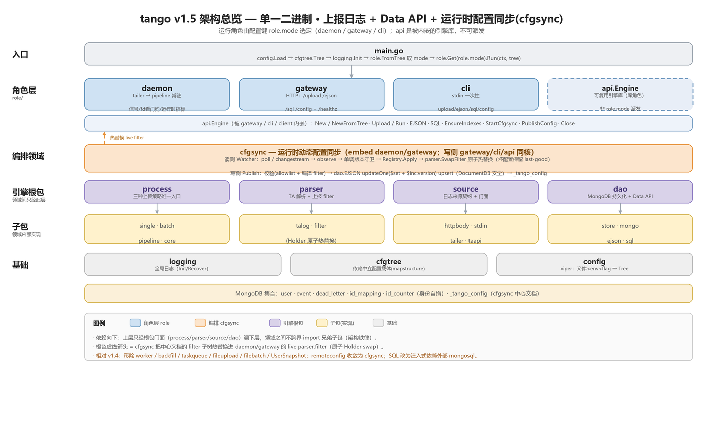
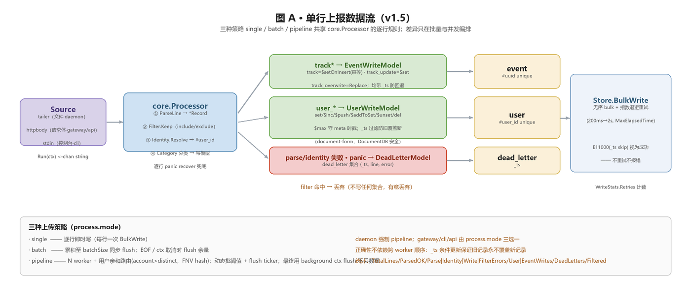
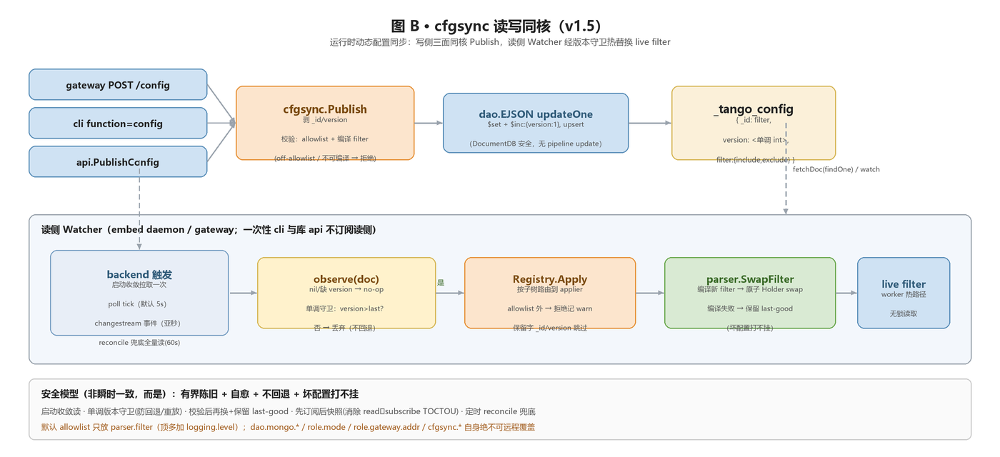

# tango 架构说明

> 本文对应 **v1.6**（v1.6.0 落地 `uploadfile` 一次性文件导入，见 §9；v1.6.1 落地 `backfill`
> TA OpenAPI 历史回填，见 §10；正式需求见 [`requirements.md`](requirements.md)）。v1.5 的全部内容仍描述当前系统、原样保留。

## 0. 架构图

> 以下三张图按 v1.4（[doc/v1.4](../v1.4)）的画法重绘 v1.5 形态，由
> [`make_diagrams.py`](../v1.5/make_diagrams.py)（纯 Pillow）生成，改图后重跑该脚本即可。
> v1.6.0 仅新增 uploadfile 源与四层入口（§9），图暂未重绘，仍沿用 v1.5 版本。

**图 0 · 架构总览**（分层：入口 → 角色 → 编排领域 cfgsync → 引擎根包 → 子包 → 基础）



**图 A · 单行上报数据流**（三策略共享 `core.Processor`：parse→filter→identity→写模型→BulkWrite）



**图 B · cfgsync 读写同核**（写侧三面 `Publish` + 读侧 `Watcher` 版本守卫热替换 live filter）



> 相对 v1.4 的结构差异：**移除** worker 角色 / backfill / taskqueue / fileupload / filebatch /
> UserSnapshot；remoteconfig **收敛为 cfgsync**；SQL Data API 由"拷贝 mongosql"改为**注入式依赖外部
> `aura-studio/mongosql`**；新增 daemon 的 **fd 看门狗 + 运行时指标**与三处 **`NewFromTree`** 接线。

## 1. 目标

`tango` 将 ThinkingData 日志 JSON 行采集并写入 MongoDB 的 `user` / `event` /
`dead_letter` 集合。它是单一二进制，按运行角色组织，只保留**上报日志**能力。
所有上报角色共享同一个引擎（`internal/role/api`），区别只在数据**来源**与**入口形态**：

| 角色 | `role.mode` | 来源 | 职责 |
|---|---|---|---|
| **Daemon** | `daemon` | tailer（文件） | 常驻：文件追尾、解析、filter、identity、流水线批量写 MongoDB |
| **Gateway** | `gateway` | httpbody（HTTP 请求体） | 常驻 HTTP：`/upload`（按 `process.mode` 选 single/batch/pipeline）+ 独立的 `/ejson`（Mongo Data API）+ `/sql`（SQL Data API） |
| **CLI** | `cli` | stdin（控制台）/ uploadfile（存量文件，`function=uploadfile`）/ backfill（TA OpenAPI 历史，`function=backfill`） | 一次性：`role.cli.function=upload` 对齐 `/upload`；`=uploadfile` 按 glob 一次性导入存量文件（不读 stdin，见 §9）；`=backfill` 拉 ThinkingData OpenAPI 历史回填（不读 stdin，见 §10）；`=ejson` 对齐 `/ejson`；`=sql` 对齐 `/sql` |
| **API** | （库，不可派发） | httpbody（调用方传入）/ uploadfile / backfill（TA OpenAPI） | 作为 Go 库被业务代码 import：`api.New(...).Upload(lines)` / `.UploadFile(cfg)` / `.RunBackfill(cfg)` / `.EJSON(req)` / `.SQL(query)` |

除上报外，三端还共享两个 Data API：**Mongo Data API**（`internal/dao/ejson`）与 **SQL Data API**
（`internal/dao/sql`，代码自 `aura-studio/mongosql` 拷贝），均由 `dao` 根包经 `dao.go` 中转：
gateway `POST /ejson`+`/sql`、cli `function=ejson`/`sql`、库 `engine.EJSON(req)`/`engine.SQL(query)`，
功能核心完全一致、只是入口形态不同
（与上报的 `api.Engine` 复用模式一致）。见 §5.2。

运行角色由配置键 `role.mode` 选定（不是子命令），`role.Get(mode)` 取对应 `Role` 对象执行。
gateway / cli / api 三者都通过同一个 `process.mode` 配置选择 single/batch/pipeline（都内嵌 api 引擎）；
daemon 是长驻的 pipeline 流水线。api 只作为库使用，不由 `role.mode` 派发。

## 2. 设计约定（其他会话务必遵守）

这些约定是项目的核心结构原则，新增/修改代码时必须保持：

1. **根包整合子包（root-fronts-subpackages）**：每个领域有一个根包，对外只暴露根包，
   子包是其实现细节。已建立的根包：
   - `internal/dao`（`Dao` 显式持有 `Mongo` + `Store`，`dao.Config` 聚合 mongo/store 配置）整合 `dao/store` + `dao/mongo`
   - `internal/parser`（`Parser` 内嵌 `*talog.Parser`，持有 filter）整合 `parser/talog` + `parser/filter`
   - `internal/process`（`process.go`）整合 `process/core`（共享 Processor/stats）+ `process/single` + `process/batch` + `process/pipeline`
   - `internal/role` 是运行模式集合：`daemon` / `gateway` / `cli` / `api`
   - `internal/source` 是数据来源集合：`source.Source` 契约（`Run(ctx) <-chan string`）+ `source/httpbody`（HTTP 请求体，gateway/api 用）/ `source/tailer`（文件追尾，daemon 用）/ `source/stdin`（控制台，cli 用）/ `source/uploadfile`（存量文件一次性导入，cli `function=uploadfile` / 库 / SDK 用，v1.6.0）/ `source/taapi`（占位）
   - `internal/backfill`（**v1.6.1**）是 TA OpenAPI 历史回填领域（自 v1.0 tag `8bc899b` 迁回、按 mongo driver v2 + DocumentDB 安全重建）：`backfill.NewRunner` 经 submit-sql→poll→paginate 拉 ThinkingData 历史，event 表逐页复用 `Engine.Upload`、user 表写 user 快照，进度落 `_backfill_progress`。它**不是 `source.Source`**（不走源 channel 抽象，自带 runner/executor 编排），由 `role/api` 经 `Engine.RunBackfill` 内嵌；import `internal/dao` + `internal/parser/filter` + `internal/process`，被 `internal/role/api` import（见 §10）
   - 6 个根包统一文件形态：`<包名>.go`（主类型/逻辑/包文档）+ `config.go`（该领域的 `Config` 聚合）。
     即 `logging/logging.go`、`dao/dao.go`、`parser/parser.go`、`source/source.go`、`process/process.go`、`role/role.go`，各配 `config.go`。
   - **该约定现已端到端强制：领域之间只经根包接口互相引用，任何包都不再 import 兄弟领域的子包**
     （即不存在 `process/* → dao/store`、`process/* → parser/talog|filter`、`role/* → source/httpbody|stdin|tailer`、
     `role/* → parser/filter` 这类跨领域子包引用）。为此每个根包把子包里被跨领域复用的符号在 `<包名>.go` 里**重导出成门面**：
     - `dao.go`：`type Store = store.Store`（别名）+ `UserWriteModel`/`EventWriteModel`/`EventWriteModelSkipExisting`/`DeadLetterModel`（薄包装，返回值 `mongo.WriteModel` 是驱动类型，按设计不再隐藏）。
     - `parser.go`：`type Record = talog.Record`、`type RecordCategory = talog.RecordCategory`、`CategoryUser`/`CategoryEvent`、`EnvelopeKeys`（重导出）；过滤器经 `Parser.Filter()` 取 `*filter.Holder`，故消费方无需 import `parser/filter`。
     - `source.go`：`NewLines`（httpbody）/`NewReader`（stdin）/`NewTailer`（tailer）/`NewUploadFile`（uploadfile）四个构造器门面，role 经它们建源。
     唯一被允许的"跨界"是 `client → role/api`（公共门面包装引擎，见 §7）；领域**自身的**子包之间（如 `process/single → process/core`、`role/cli → role/api`）不受此限。
2. **配置键路径 = 包路径；config 只产出一棵 Tree**：配置结构体下沉到各自模块并由领域根包聚合
   （`dao.Config` 聚合 `mongo`/`store`，`parser.Config` 聚合 `filter`，`process.Config` 聚合 `pipeline`，
   `source.Config` 聚合 `tailer`/`uploadfile`，`role.Config` 聚合 `gateway`），使**每个文件键路径都等于消费它的包路径**（`internal/` 下）：
   `logging.level`、`dao.mongo.uri`、`dao.store.maxElapsedTime`、`parser.filter.*`、
   `source.tailer.*`、`source.uploadfile.*`、`process.pipeline.*`、`role.gateway.*`。**没有顶层 typed 聚合结构体**：
   `config.Load` 把 文件 < `TANGO_*` env < flag 解析后，用 `viper.AllSettings` 物化成一棵**依赖中立**的
   `cfgtree.Tree`（只依赖 `mapstructure`，不依赖 viper；viper 只困在 `config` 包内）。每个模块提供
   `FromTree(t) = t.Sub("<前缀>").Into(&cfg) + ApplyDefaults + Validate`，自取并校验**自己那棵子树**
   （模块拥有"前缀 + 解码 + 默认 + 校验"）。
   **三个途径一致**：`RegisterFlags` 为每个键注册同名 `--<键>` flag，故 文件/env/flag 可互换；
   运行角色由配置键 `role.mode` 选定（不是子命令），上传策略由配置键 `process.mode` 选定；`--config` 是文件路径、非配置键。
   叶子模块**不得 import 顶层 `config` 包**，只依赖叶子载体 `cfgtree`。依赖方向：`config` → `cfgtree` + 各模块；各模块 ↛ `config`。
3. **`process` 是三种上传方式的唯一对外入口**：`single`（逐行即时写）/`batch`（同步批量）/
   `pipeline`（异步流水线）不被外部直接 import，三者实现同一 `process.Uploader` 接口
   （`Run(ctx, source.Source) error` + `Stop()`，可启动可停止，都消费一个日志源）；
   role 与 client SDK 只用 `process` 的 `New(cfg, *dao.Dao, *parser.Parser, *Counters)` / `Mode` /
   `ParseMode` / `Source`（=`source.Source` 别名）/ `Counters` / `Snapshot`。
4. **日志是全局底层**：统一用 `internal/logging` 的包级函数（`logging.WithError`、`logging.Info`…），
   不要把 `*logrus.Logger` 当对象到处透传。`logging.Init(cfg)` 在启动时配置一次
   （接收完整的 `*logging.Config`，应用 level 与 format）。
5. **MaxElapsedTime（bulk-write 重试预算）属于 store**，不属于 mongo 连接配置；
   配置文件键为 `dao.store.maxElapsedTime`。
6. **配置结构 = internal 包层级；角色不重复 host 模块配置**：模块配置都在各自包路径的顶层
   （`logging.*`/`dao.*`/`parser.filter.*`/`source.tailer.*`/`source.uploadfile.*`/`process.*`），由需要的角色**共享复用**；
   `role.<name>.*` 只放该角色**专属**的字段（如 `role.gateway.addr`）。
   例如 gateway 的上传处理直接用顶层 `process.*` 与 `parser.filter.*`，不在 `role.gateway` 下再开
   `process`/`filter`。`role.daemon` 暂为空（daemon 完全由顶层模块驱动）。
   角色拿到整棵 `cfgtree.Tree`，通过各模块 `FromTree` **按枝叶裁剪**自己需要的子树
   （如 gateway 取 `dao`/`process`/`parser.filter` + `role.gateway`），而不是接收一个预先拆好的聚合结构。
7. **角色统一为 `Role` 接口，外层按 `role.mode` 派发**：`internal/role` 定义
   `Role`（`Run(ctx, cfgtree.Tree) error`）与 `Get(mode) (Role, error)`；`daemon`/`gateway`/`cli` 各实现 `Role`，
   并把启动编排（daemon 的信号处理/启动日志、cli 的 stdin→JSON stdout）折入各自的角色实现。
   `main.go` 只做 `Load→Tree → logging.FromTree+Init → role.FromTree 取 mode → role.Get(mode).Run(ctx, tree)`，
   **不再有 `cmd/` 包**。`api` 仍是被 gateway/cli 内嵌的引擎库，不是可派发角色。

## 3. 目录结构

```text
.
├── main.go      # Load→Tree → logging.Init → role.Get(role.mode).Run(ctx, tree)（无 cmd/ 子命令）
├── config/      # 构建并物化 cfgtree.Tree（Load/RegisterFlags）；不定义任何配置字段，viper 只在此
├── doc/ examples/
└── internal/
    ├── cfgtree/    # 依赖中立的配置载体 cfgtree.Tree（Sub/Into；只依赖 mapstructure）
    ├── logging/    # 全局 logger + logging.Config（+ FromTree）
    ├── parser/     # parser.go 整合 talog + filter（日志解析层）+ talog 门面（Record/categories/EnvelopeKeys 重导出）
    │   ├── config.go # parser.Config：聚合 parser 子模块配置
    │   ├── talog/    # TA JSON 行解析 -> Record
    │   └── filter/   # expr-lang include/exclude 上报过滤器 + filter.Config + sql.go（CompileToSQL：expr → Presto WHERE，backfill 下推用，v1.6.1）
    ├── source/     # 数据来源集合（source.Source 契约 + source.Config 聚合 tailer/uploadfile）+ New{Lines,Reader,Tailer,UploadFile} 构造器门面
    │   ├── httpbody/ # HTTP 请求体来源（NewLines；gateway/api 用）
    │   ├── tailer/  # 文件追尾来源 + tailer.Config / TailMode 常量（NewTailer；daemon 用）
    │   ├── stdin/   # 控制台 stdin 来源（NewReader；cli 用）
    │   ├── uploadfile/ # 存量文件一次性导入来源 + uploadfile.Config（NewUploadFile；cli function=uploadfile / 库 / SDK 用，v1.6.0）
    │   └── taapi/   # 占位（未来 TA API 来源）
    ├── dao/        # dao.go 整合 store + mongo + ejson + sql 门面（Store 别名 / 写模型构造器 / Mongo&SQL Data API 重导出）
    │   ├── config.go # dao.Config：聚合 mongo.Config + store.Config
    │   ├── store/    # MongoDB 持久化 + store.Config
    │   ├── mongo/    # 连接装配 + mongo.Config + MongoDBFromURI
    │   ├── ejson/    # 通用 Mongo Data API 共享核心：Request/Response/Execute + EJSON 编解码（经 dao.go 中转）
    │   └── sql/      # SQL Data API 薄包装：注入式依赖外部 aura-studio/mongosql（sql.go 注入 db + result.go MarshalEJSON）
    ├── process/    # process.go 统一管理三种上传方式（唯一对外入口；Uploader 接口 + New）
    │   ├── core/    # 共享 Processor（parse→filter→identity→写模型；经 dao/parser 根包门面）+ stats（Counters/StatsCollector）
    │   ├── single/  # 逐行即时写 Uploader
    │   ├── batch/   # 同步批量 Uploader（累积 + bulk flush）
    │   └── pipeline/# 异步 N-worker 流水线 Uploader + pipeline.Config + dynamicbatch
    ├── backfill/   # v1.6.1 TA OpenAPI 历史回填领域（runner/executor 编排；自 v1.0 8bc899b 迁回、driver v2 + DocumentDB 安全重建）
    │   ├── client.go    # 包文档（package 注释在此）+ TA OpenAPI 客户端：submit-sql → sql-task-info（poll）→ sql-result-page（分页 NDJSON），token 为 query param；StatusRunning/Finished/Failed、APIError、ErrTaskExpired
    │   ├── httpclient.go# net/http + x/net/proxy（http/https/socks5）+ backoff/v4 重试封装
    │   ├── ndjson.go    # NDJSON 结果页流式解码（逐行 → row）
    │   ├── rowdecode.go # EncodeRowAsJSONLine：event 行 → TA JSON 日志行（#/_/$ 前缀列升顶层，其余进 properties，nil 丢弃）
    │   ├── sqlbuilder.go# buildDaySQL：SELECT * FROM [schema.]v_event_<pid> WHERE "$part_date"=... 等；user 表全表 SELECT
    │   ├── checkpoint.go# _backfill_progress 状态机：每 RunID 一文档、按 page flush；SQLSignature 漂移守卫；FindOne+ReplaceOne upsert（无 pipeline update）
    │   ├── runner.go    # NewRunner：按表分支编排日期分块/全表、调用 client、分页驱动两路写入、续跑
    │   ├── executor.go  # 两路写入执行：event → 注入的 upload 回调（=Engine.Upload）；user → dao.UserSnapshotWriteModel + Store.BulkWriteOrdered
    │   ├── stats.go     # 回填统计：内嵌 process.Counters + Pages/HTTPErrors/DaysCompleted/DaysFailed；跨层结果类型 UploadStats（Lines/UserWrites/EventWrites/DeadLetters/Filtered）
    │   └── config.go    # backfill.Config（backfill.*）+ FromTree/RegisterDefaults/ApplyDefaults/Validate + 助手（ForceSkip/ShouldPaginate/...）+ 表名常量 TableEvent/TableUser/DefaultProgressCollection
    └── role/       # 运行角色：Role 接口 + Get(mode) 派发；role.Config 聚合 daemon/gateway/cli
        ├── api/     # 可复用引擎库：api.Engine（New/Upload/Run/EnsureIndexes/Close）——非可派发角色
        ├── daemon/  # daemon.Role + daemon.Service（pipeline + tailer；含信号处理/启动日志）
        ├── gateway/ # gateway.Role + HTTP Server：内嵌 api.Engine + /upload + /ejson + /sql；gateway.Config（role.gateway.*）
        └── cli/     # cli.Role：内嵌 api.Engine + stdin/uploadfile 源；cli.Config（role.cli.function=upload|uploadfile|ejson|sql|config|configget）
```

依赖方向：

```text
main             -> config + role + logging
client           -> role/api                                       (公共门面，redis-go 风格，包装引擎)
role             -> cfgtree + role/(daemon/gateway/cli/api)         (Role 接口 + Get(mode) 派发)
role/api         -> process + parser + dao + source + backfill + logging (引擎库，被 gateway/cli 内嵌；Mongo Data API 经 dao 中转；RunBackfill 借引擎已有 Mongo/dao)
backfill         -> dao + parser/filter + process + cfgtree + logging  (v1.6.1 回填领域；event 路经注入回调复用 Engine.Upload 避免 api↔backfill 环；user 路写快照)
role/gateway     -> api + dao + process + parser + cfgtree + logging (gateway.Role + HTTP 面)
role/cli         -> api + dao + process + parser + source + cfgtree   (cli.Role + stdin/数据 面)
role/daemon      -> process + parser + dao + source + cfgtree + logging (daemon.Role + Service)
process          -> process/(core/single/batch/pipeline) + source + dao + parser + cfgtree
process/<子包>   -> dao + parser + source + (core)                  (经 dao/parser 根包门面，不碰 dao/store、parser/talog|filter)
parser           -> talog + filter + cfgtree                        (根包整合，对外重导出 Record/categories/EnvelopeKeys)
dao              -> store + mongo + ejson + sql + cfgtree            (根包整合，对外重导出 Store/写模型构造器 + Mongo&SQL Data API)
dao/ejson        -> dao/mongo（+ bson/mongo/options 驱动）           (dao 子包；用 MongoResource 取 client 与默认库)
dao/sql          -> dao/mongo + mongosql（外部依赖，注入 db）         (dao 子包；mongosql.New(db) 注入式，SQL→MongoDB)
source           -> httpbody + stdin + tailer + uploadfile + cfgtree (根包整合，对外暴露 Source + New{Lines,Reader,Tailer,UploadFile})
source/uploadfile -> source/tailer（仅 DiscoverFiles 复用）+ logging   (同领域子包互引，不跨领域；无 dao 依赖)
cfgtree          -> mapstructure   (叶子载体，不依赖 viper)
config           -> cfgtree + 各模块（仅用其 RegisterDefaults 注册键）；viper 只在 config
各模块通过 cfgtree.Tree 解码（FromTree）；各叶子模块 ↛ config；领域之间只经根包，不跨领域 import 兄弟子包
```

### 3.1 文件功能清单

#### 入口层 `main.go`（无 cmd/ 子命令）

| 文件 | 职责 |
|---|---|
| `main.go` | 根 cobra 命令（`NoArgs`）；`config.RegisterFlags` 注册全键 flag；`run` = `config.Load`→Tree → `logging.FromTree`+`Init` → `role.FromTree` 取 mode → `role.Get(mode).Run(ctx, tree)`；含 configFlag/resolveConfigPath |

#### 配置载体 `internal/cfgtree`（依赖中立，只依赖 mapstructure）

| 文件 | 职责 |
|---|---|
| `cfgtree/cfgtree.go` | `Tree`（已物化设置 map + 当前路径）；`New(settings)` / `Sub(key)`（累加路径，不新建子 viper）/ `Into(dst)`（沿路径取子树 + 时长/切片 hook + 弱类型，纯 mapstructure 解码） |

#### 配置层 `config/`（构建 Tree；不定义任何字段，viper 只在此）

| 文件 | 职责 |
|---|---|
| `config/config.go` | `registerAll`：枚举各模块 `RegisterDefaults`（唯一知道顶层段列表的地方），无 typed 聚合结构 |
| `config/load.go` | `Load`（文件<env<flag → `viper.AllSettings` 物化 → `cfgtree.New`）+ `RegisterFlags`（每键注册同名 flag） |
| `config/loader.go` | viper 装配 helper（`newViper` env 前缀、`readConfigFile`、`bindFlagsTo`） |

#### 全局基础 `internal/logging`

| 文件 | 职责 |
|---|---|
| `logging/logging.go` | 进程级 logger：`Init`、`L`、`WithError`/`WithField`/`WithFields`、`Info`/`Warn`/...、`Fields` 别名 |
| `logging/config.go` | `logging.Config`（level/format） |

#### 解析层 `internal/parser`

| 文件 | 职责 |
|---|---|
| `parser/parser.go` | `Parser`：内嵌 `*talog.Parser` + 持有 `*filter.Holder`（`Filter()`）；`New(flt)`；**talog 门面**：`type Record`/`RecordCategory` 别名 + `CategoryUser`/`CategoryEvent` + `EnvelopeKeys` 重导出 |
| `parser/talog/parser.go` | `Parser.ParseLine`：TA JSON → `Record` |
| `parser/talog/record.go` | `Record` + `Category`/`IsUserType`/`IsEventType` |
| `parser/filter/filter.go` | `Filter`：expr-lang 编译与 `Keep` |
| `parser/filter/holder.go` | `Holder`：原子可热替换的 filter 持有者 |
| `parser/filter/config.go` | `filter.Config`（include/exclude）+ `Build()` |
| `parser/filter/sql.go` | **v1.6.1** `CompileToSQL(include, exclude)`：把 expr-lang include/exclude 编译成 Presto WHERE 体 `(inc1 OR inc2) AND NOT (exc1 OR exc2)`；`#field` → `"field"` 双引号列；支持 `==`/`!=`/`<`/`<=`/`>`/`>=`/`&&`(`and`)/`||`(`or`)/`in`/`!`(`not`) + 字面量；不支持的节点（函数调用等）报错。供 backfill 把选择 filter 下推到 TA SQL |

#### 来源层 `internal/source`

| 文件 | 职责 |
|---|---|
| `source/source.go` | `source.Source` 契约：`Run(ctx) <-chan string`；**子包门面**：`NewLines`(httpbody)/`NewReader`(stdin)/`NewTailer`(tailer)/`NewUploadFile`(uploadfile，容忍 nil cfg) 构造器 |
| `source/config.go` | `source.Config`：聚合 `tailer.Config`（键 source.tailer.*）+ `UploadFile *uploadfile.Config`（键 source.uploadfile.*） |
| `source/httpbody/httpbody.go` | `httpbody.Source`：把预解析的行数组（单条/批量）包成 line channel（gateway/api 用） |
| `source/stdin/stdin.go` | `stdin.Source`：从 io.Reader/os.Stdin 逐行扫描成 channel（cli 用） |
| `source/tailer/tailer.go` | `Tailer`：glob 发现文件、追尾、rescan，输出 line channel（hybrid/poll/event） |
| `source/tailer/config.go` | `tailer.Config`（含 `logPattern`/`tailMode`/`rescanInterval`/`pollInterval`/`maxLineBytes`/**`maxOpenFDs`** fd 看门狗阈值）+ `TailModeHybrid`/`Poll`/`Event` 常量 |
| `source/uploadfile/uploadfile.go` | **v1.6.0** `uploadfile.Source`：有限一次性导入源——复用 `tailer.DiscoverFiles` 按 glob 发现一次，按发现顺序把每个文件从头到 EOF 的非空行送入 channel（cap 2000）后关闭；scanner 语义同 tailer（64KiB 起步、上限 maxLineBytes）；单文件错误（打不开 / `bufio.ErrTooLong`）记日志跳过、不影响其余文件；无 checkpoint（详见 §9） |
| `source/uploadfile/config.go` | `uploadfile.Config`（`logPattern` []string + `maxLineBytes`，默认 10485760）+ `RegisterDefaults`/`ApplyDefaults`（无 Validate——无可枚举值） |
| `source/taapi/taapi.go` | 占位包（预留未来 TA API 来源，无导出符号） |

#### 数据访问 `internal/dao`

| 文件 | 职责 |
|---|---|
| `dao/dao.go` | `Dao`：显式持有 `Mongo *mongo.MongoResource` + `Store *store.Store`；`New(res, cfg)` 装配 store；**store 门面**：`type Store = store.Store` 别名 + `UserWriteModel`/`EventWriteModel`/`EventWriteModelSkipExisting`/`DeadLetterModel` 重导出；**ejson 门面**：`type EJSONRequest/EJSONResponse = ejson.Request/Response` 别名 + `EJSONAction*` 常量 + `DecodeEJSONRequest` + `(*Dao).EJSON` 中转；**sql 门面**：`type SQLResult = sql.Result` 别名 + `(*Dao).SQL`（惰性 `sync.Once` 建 `*sql.Driver`）中转 |
| `dao/config.go` | `dao.Config`：聚合 `mongo.Config` + `store.Config` |
| `dao/store/store.go` | `Store` + `store.Config`(MaxElapsedTime) + `WriteStats` + `BulkWrite(Ordered)` + 集合访问器 |
| `dao/store/identity.go` | `IdentityResolver`：`#account_id`/`#distinct_id` → `#user_id` |
| `dao/store/indexes.go` | `EnsureIndexes`：user/event/dead_letter/id_mapping 索引 |
| `dao/store/writemodel.go` | 构建写模型与 dead-letter 模型（`_ts` 防回退） |
| `dao/mongo/mongo.go` | `MongoResource` + `ConnectMongo`/`Borrow`/`DatabaseFromClient`/`Close` |
| `dao/mongo/config.go` | `mongo.Config`（URI + 连接超时）+ `MongoDBFromURI` |

#### Mongo Data API `internal/dao/ejson`（dao 子包，经 dao.go 中转）

| 文件 | 职责 |
|---|---|
| `dao/ejson/ejson.go` | `Request`/`Response` 类型 + action 常量 + `Execute(ctx, *mongo.MongoResource, *Request)`：从 resource 取 client 与默认库、解析 db/collection、按 action 分发 findOne/find/insertOne/updateOne/deleteOne/aggregate，选项（sort/projection/limit/skip/upsert）原样转发；无白名单/上限 |
| `dao/ejson/codec.go` | `DecodeRequest`（`bson.UnmarshalExtJSON`，relaxed，兼容 JSON）+ `(*Response).MarshalEJSON`（`bson.MarshalExtJSON` relaxed） |

#### SQL Data API `internal/dao/sql`（dao 子包，**注入式依赖外部 `aura-studio/mongosql`**，经 dao.go 中转）

> v1.5 变更：不再"拷贝" mongosql 的 driver/translator 进 tango，而是 `go.mod` require
> `github.com/aura-studio/mongosql` 并用其注入构造器 `mongosql.New(db)`。SQL 解析/翻译/执行（vitess
> sqlparser + translator + SchemaStore）全在外部依赖里，更新经版本号上调流入；tango 侧只剩薄包装。

| 文件 | 职责 |
|---|---|
| `dao/sql/sql.go` | `Driver`（持有 `*mongosql.Driver`）+ `New(*mongo.MongoResource)`（把已解析的 `*mongo.Database` 注入 `mongosql.New`，不自拨号/不 Close、共享连接池；nil 资源报错）+ `Exec(ctx, sql)` 透传到 mongosql 后转 tango `Result` |
| `dao/sql/result.go` | `Result`（`Kind`/`Rows`/`InsertedIDs`/`MatchedCount`/`ModifiedCount`/`DeletedCount`，bson 标签）+ `fromMongosql` 转换 + `(*Result).MarshalEJSON`（SELECT 行含 BSON 类型，relaxed EJSON 编码） |

#### 处理层 `internal/process`（`process.go` 唯一对外）

| 文件 | 职责 |
|---|---|
| `process/process.go` | 对外门面：`Uploader` 接口 + `Mode`/`ParseMode` + `New(cfg, *dao.Dao, *parser.Parser, *Counters)`；`Source`/`Counters`/`Snapshot` 别名（无 `WriteOptions`） |
| `process/core/processor.go` | `core.Processor.Process`：parse→filter→identity→写模型分类（`Kind`/`Result`）；逐行 panic recover；`NewProcessor(*parser.Parser, *dao.Store, …)` 只依赖 dao/parser 根包门面 |
| `process/core/stats.go` | `StatsCollector` 接口 + `NoopStats` |
| `process/core/counters.go` | `Counters`（并发计数器）+ `Snapshot` |
| `process/single/uploader.go` | `single.Uploader`：逐行即时写（`Run`/`Stop`） |
| `process/batch/uploader.go` | `batch.Uploader`：drain 源 → 累积写模型 → bulk flush（`Run`/`Stop`） |
| `process/pipeline/uploader.go` | `pipeline.Uploader`：包装 `RunWorkers`（`Run`/`Stop`） |
| `process/pipeline/worker.go` | `RunWorkers`/`worker`：N 并发 + 批累积 + 动态刷新 |
| `process/pipeline/config.go` | `pipeline.Config` + `MinBatchSize`/`MaxBatchSize`/`ChannelSize` |
| `process/pipeline/dynamicbatch.go` | `ComputeFlushThreshold`：按 backlog 自适应刷新阈值 |
| `process/pipeline/batch.go` | `Batch`：写模型批容器 |
| `process/pipeline/dispatch.go` | `Dispatch`：按亲和键路由到各 worker channel |
| `process/pipeline/routing.go` | `ExtractRoutingKey`/`RouteIndex`：用户亲和性 hash 路由 |

#### TA OpenAPI 历史回填 `internal/backfill`（**v1.6.1** 顶层领域，非角色；被 `role/api` 经 `Engine.RunBackfill` 内嵌）

| 文件 | 职责 |
|---|---|
| `backfill/client.go` | **包文档（package 注释在此）** + TA OpenAPI 客户端：`submit-sql`（提交 Presto SQL，返回 taskId）→ `sql-task-info`（按 `pollInterval` 轮询至完成，超 `pollTimeout` 报错）→ `sql-result-page`（按 `pageId` 分页拉 NDJSON）；token 作为 query param 拼入 URL；状态常量 `StatusRunning/Finished/Failed`、`APIError`、`ErrTaskExpired` 也在此 |
| `backfill/httpclient.go` | 底层 HTTP：`net/http` + `golang.org/x/net/proxy`（http/https/socks5，DIRECT 依赖）+ `backoff/v4`（按 `pageRetries` 重试） |
| `backfill/ndjson.go` | 结果页 NDJSON 流式解码：逐行 `json.Decode` → `map[string]any` row，边解边交回填驱动（不全量驻留） |
| `backfill/rowdecode.go` | `EncodeRowAsJSONLine(row)`：event 行 → TA JSON 日志行——`#`/`_`/`$` 前缀列升到顶层信封，其余列收进 `"properties"`，nil 值丢弃；产出喂给 `Engine.Upload` 复用 parse→filter→identity→写 |
| `backfill/sqlbuilder.go` | `buildDaySQL`：`SELECT * FROM [schema.]v_event_<pid> WHERE "$part_date"='<day>' [AND "#event_time">='...'][AND "#event_time"<='...'][AND <filterWhere>][LIMIT n]`；user 表 = `SELECT * FROM v_user_<pid>`（无分区/事件时间），`filterWhere` 来自 `filter.CompileToSQL` |
| `backfill/checkpoint.go` | `_backfill_progress` 状态机：每 `RunID` 一文档（`_id=RunID`），event 按天 chunk / user 单 `UserChunkKey`；**每 page flush** `DayProgress`（status/taskId/pageId/pageCount/rows/error），中断后从下一页续；`SQLSignature`（table/projectID/filterWhere/eventTimeRange，**不含 partDateRange**）守卫漂移，同 RunID 签名变 → `ErrSignatureMismatch` 拒续；`FindOne` 读 + `ReplaceOne` upsert，均 DocumentDB 安全（绝不 pipeline update） |
| `backfill/runner.go` | `NewRunner` + `Run`：按 `table` 分支——event 按 `partDateRange` 逐日、user 全表单块；读 checkpoint 续跑 → 调 client submit/poll/paginate → 逐页交 executor → 每页写回 checkpoint；汇总 `UploadStats`（`Result()`） |
| `backfill/executor.go` | 两路写入：**event** 逐页把行 `EncodeRowAsJSONLine` → 注入的 upload 回调（= `Engine.Upload`，经本地 `UploadStats` 桥避免 api↔backfill 环），Engine 上报 filter（`parser.filter.*`）在此路生效；backfill 选择 filter（include/exclude）**仅经 SQL 下推**，event 路不再本地重复过滤；**user** 行绕过 parser，每行 → `dao.UserSnapshotWriteModel(#user_id, doc, forceSkipExisting)`（纯 `$set`/`$setOnInsert`，无聚合管线），经 `Store.BulkWriteOrdered` 批写；backfill 本地兜底 filter **仅在 user 路**内联应用（除非 `skipLocalFilter`） |
| `backfill/stats.go` | 回填统计：内嵌 `process.Counters`（十项逐行指标）+ `Pages`/`HTTPErrors`/`DaysCompleted`/`DaysFailed`；跨层结果 `UploadStats`（Lines/UserWrites/EventWrites/DeadLetters/Filtered），由 `Runner.Result()` 汇出、Engine 映射成 `api.Result` |
| `backfill/config.go` | `backfill.Config`（`backfill.*`）+ `FromTree`/`RegisterDefaults`/`ApplyDefaults`/`Validate` + 助手 `ForceSkip`/`ShouldPaginate`/`EffectivePageSize`/`IncludeExprs`/`BackfillWhere`（见 §10.6） |

#### 运行时动态配置同步 `internal/cfgsync`（顶层领域，非角色；被 daemon/gateway 内嵌）

| 文件 | 职责 |
|---|---|
| `cfgsync/cfgsync.go` | 包文档 + `Watcher`（读侧）：持有 `*dao.Dao`/`*Config`/注入的 `onChange func(bson.M) error` + 单调 `lastVersion`；`New(d, cfg, onChange)` / `(*Watcher).Run(ctx)`（选 backend → 启动拉取 → backend 循环）；`observe` = nil 文档 no-op + 缺版本忽略 + **单调版本守卫**（`<= lastVersion` 丢弃）+ 调 `onChange`（失败记 warn 保留 last-good，不停循环） |
| `cfgsync/backend.go` | `Backend` 接口（`Run(ctx, observe)`）+ `selectBackend(d,cfg)`（poll/changestream/未知报错） |
| `cfgsync/config.go` | `cfgsync.Config`（`enabled`/`backend`/`documentID`/`pollInterval`/`reconcileInterval`/`collection`）+ `FromTree`/`ApplyDefaults`/`Validate`/`RegisterDefaults` + backend/默认常量 |
| `cfgsync/poll.go` | `pollBackend`：启动拉取一次 → 每 `pollInterval` 经 `fetchDoc` 读 → `observe`；读错误记 warn 不中断（自愈），任意拓扑可用 |
| `cfgsync/changestream.go` | `changeStreamBackend`：**先订阅后快照**（消除 read↔subscribe TOCTOU）→ stream 事件 + `reconcileInterval` 兜底全量读；断流→`resubscribe`（退避）+ 全量读 fallback，不硬崩；不支持拓扑→清晰报错指向 `backend=poll` |
| `cfgsync/fetch.go` | `fetchDoc`（经 `dao.EJSON` findOne，缺文档=nil no-op）+ `docVersion`（int/int32/int64/float64 归一为 int64） |
| `cfgsync/registry.go` | **applier 注册表 / allowlist**：`Registry`（`map[subtree]ApplyFunc`）+ `Register`/`Allows`/`Apply`（按子树路由；保留字 `_id`/`version` 跳过；不在 allowlist→拒绝记 warn；applier 失败保留 last-good）；是 `onChange` 的泛化 |
| `cfgsync/filter.go` | `RegisterFilter(reg, *parser.Parser)`：把 `filter:{include,exclude}` 子树映射到 `parser.SwapFilter`（编译失败保留 last-good）；唯一默认 applier；`toStringSlice` 容错 |
| `cfgsync/publish.go` | **写侧** `Publish(ctx, d, cfg, doc) (version, err)`：`validatePublishDoc`（剥 `_id`/`version` + 经同一 Registry 干跑校验 allowlist+编译 filter）→ `dao.EJSON` updateOne（`$set`+`$inc:{version:1}`，upsert，DocumentDB 安全）→ 读回新 version |

读写同核：`Watcher`（读）与 `Publish`（写）同属 cfgsync 根包，共享 `_tango_config` 文档 schema 与单调 version；
三面发布（gateway `POST /config`、cli `function=config`、`api.PublishConfig`）共用 `cfgsync.Publish`。
详见 §5.4 与 [`cfgsync.TODO.md`](cfgsync.TODO.md)。

#### 运行模式 `internal/role`

| 文件 | 职责 |
|---|---|
| `role/role.go` | `Role` 接口（`Run(ctx, cfgtree.Tree) error`）+ `Get(mode) (Role,error)` 派发 + 角色名常量（`API`/`CLI`/`Daemon`/`Gateway`） |
| `role/config.go` | `role.Config`：聚合 `daemon`/`gateway`/`cli` + `ApplyDefaults`/`Validate`/`RegisterDefaults` + `FromTree` |
| `role/api/api.go` | 可复用引擎库 `api.Engine`：`New(ctx, *dao.Config, *process.Config, *parser.Config, *cfgsync.Config)` / `NewFromTree(ctx, tree)`（切 dao/process/parser/cfgsync 子树）/`Upload(lines)`（经 `source.NewLines`）/`UploadFile(ctx, cfg)`（**v1.6.0**：先拒空 `LogPattern`（`"api: uploadfile logPattern is required"`，先于任何 source/库操作）再 `Run(source.NewUploadFile(cfg))`；`api.UploadFileConfig` = `source.UploadFileConfig`（经 source 门面、最终 = `uploadfile.Config`，在 `role/api/config.go`——role 层不 import source 子包）/`Run(src)`/`RunBackfill(ctx, *api.BackfillConfig) (Result, error)`（**v1.6.1**：先 `Validate` 再借引擎已有 Mongo/dao 跑 `backfill.NewRunner`，event 路经本地 `UploadStats` 适配 `Engine.Upload` 以避 api↔backfill 环；`api.BackfillConfig` = `backfill.Config` 别名，在 `role/api/config.go`）/`EJSON(req)`（Mongo Data API）/`SQL(query)`（SQL Data API）/`EnsureIndexes`/`Close`/`StartCfgsync(ctx)`（仅 `cfgsync.enabled` 时起 Watcher goroutine）/`PublishConfig(ctx, doc)`（中转 `cfgsync.Publish`）+ `Result`（非可派发角色） |
| `role/daemon/role.go` | `daemon.Role.Run`：`signal.NotifyContext(SIGINT/SIGTERM)` → `NewFromTree`（切 dao/parser/source/process/cfgsync + **fail-fast 校验 logPattern，先于连 Mongo** + 启动 banner，含 `maskURI`）→ `EnsureIndexes` → `Run` |
| `role/daemon/report.go` | `daemon.Service`（`New`/`NewFromTree`）：经 `source.NewTailer` 建源 → 强制 pipeline `process.New(cfg).Run(runCtx, tailer)` → MongoDB；内嵌 cfgsync Watcher（`startCfgsync`）；`reportStats` 每 60s 打 interval/cumulative/**runtime（goroutines/open_fds/tailed_files）** 三条日志 + **fd 看门狗**（`maxOpenFDs>0 && open_fds>阈` → `cancelRun` 优雅 drain+flush+退出，交编排器重启）；`logFinalStats` 收尾摘要 |
| `role/daemon/procstats.go` | `openFDCount()`：Linux 经 `/proc/self/fd`（-1 修正 ReadDir 自身 fd）；非 Linux 返回 -1（看门狗 inert） |
| `role/daemon/config.go` | `daemon.Config`（`role.daemon.*`，暂空，schema 对称用） |
| `role/gateway/role.go` | `gateway.Role.Run`：从 Tree 取 dao/process/parser + `role.gateway` → `New` → `EnsureIndexes` → `Run(addr)` |
| `role/gateway/server.go` | gateway `Server`：内嵌 `*api.Engine` + HTTP 面；`New`/`NewFromTree`/`Upload`/`EJSON`/`SQL`/`PublishConfig`/`EnsureIndexes`/`Close`/`Handler`/`Run`；路由 `/healthz` + `/upload`（按 `process.mode` 选策略）+ `/ejson`（Mongo Data API）+ `/sql`（SQL Data API）+ `/config`（cfgsync 发布，`{version}`）；`Run` 起服务前先 `StartCfgsync`，ctx 取消时 10s 优雅 `Shutdown`；`writeEJSON` 经 `ejsonMarshaler` 接口同服务 EJSON/SQL 响应 |
| `role/gateway/config.go` | `gateway.Config`（仅 `role.gateway.addr`）+ `ApplyDefaults`/`Validate`/`RegisterDefaults` |
| `role/cli/role.go` | `cli.Role.Run`：取 dao + `role.cli`；`function=upload` 走 stdin 上报（统计 JSON → stdout），`=uploadfile`（**v1.6.0**）切 `source.FromTree` 并 **fail-fast 校验 `source.uploadfile.logPattern`（`"cli: function=uploadfile requires source.uploadfile.logPattern"`，先于连 Mongo）** 后走 `RunUploadFile`，`=backfill`（**v1.6.1**）切 `backfill.FromTree` 并在连 Mongo **之前** `Validate` 后走 `RunBackfill`（不读 stdin），`=ejson` 走 `RunEJSON`，`=sql` 走 `RunSQL` |
| `role/cli/cli.go` | `cli.RunUpload(...)`：内嵌 `api.Engine` + `source.NewReader(in)` 一次性上报；`cli.RunUploadFile(ctx, daoCfg, procCfg, parserCfg, srcCfg.UploadFile)`：`api.New` + `EnsureIndexes` + `eng.UploadFile`，统计 JSON → stdout（与 `function=upload` 同形，**不读 stdin**）；`cli.RunBackfill(ctx, daoCfg, procCfg, parserCfg, bfCfg)`（**v1.6.1**）：`api.New` + `EnsureIndexes` + `eng.RunBackfill`，`api.Result` JSON → stdout（**不读 stdin**）；`cli.RunEJSON(...)`：stdin EJSON 请求 → `engine.EJSON` → out EJSON；`cli.RunSQL(...)`：stdin SQL → `engine.SQL` → out EJSON |
| `role/cli/config.go` | `cli.Config`（`role.cli.function`=upload\|uploadfile\|backfill\|ejson\|sql\|config\|configget，常量 `FunctionUploadFile`/`FunctionBackfill`）+ `ApplyDefaults`/`Validate`/`RegisterDefaults` |

## 4. Daemon Service（daemon 模式）

```text
Tailer -> Dispatcher(按用户亲和性路由) -> Worker[i](Parse -> Filter -> Identity -> Batch) -> MongoDB BulkWrite
```

`role/daemon` 将自己的 process 配置拷贝为 `ModePipeline` 后用 `process.New(cfg, …)` 构造 pipeline `Uploader`，再
`up.Run(runCtx, tailerSource)` 驱动流水线（阻塞至 ctx 取消）；`daemon.Role.Run` 从 `cfgtree.Tree` 取各模块配置、
安装信号处理（SIGINT/SIGTERM）并启动该服务。

**运行时可观测 + fd 看门狗（v1.5.1）**：`reportStats` 每 60s 打三条日志——本周期增量、累计、以及 runtime
（`goroutines` / `open_fds` / `tailed_files`）。当 `source.tailer.maxOpenFDs>0` 且 `open_fds` 严格超过阈值时，
看门狗 `cancelRun` 触发**优雅自重启**：派生的 `runCtx` 被取消 → pipeline drain+flush（在途批次用
`context.Background()` 全部落库、不丢数据）→ `Run` 干净返回、进程 exit 0 → 编排器 `restartPolicy` 以全新 fd 表
重建容器。`open_fds` 仅 Linux 可观测（`/proc/self/fd`），非 Linux 为 -1 且看门狗 inert。SIGTERM 走父 ctx 同样
取消 `runCtx`，与看门狗互不干扰。这是 tailer reaping（根因修复）之上的 defense-in-depth 兜底。

## 5. HTTP Gateway Service（gateway 模式）

```text
GET  /healthz
POST /upload   # body: {line?, lines?[]}；上传策略来自 process.mode
POST /ejson    # body: EJSON {action, collection, ...}；通用 Mongo Data API（见 §5.2）
POST /sql      # body: JSON {"sql":"..."}；SQL Data API（见 §5.3）
```

`/upload` 把请求体的日志数组经 `source.NewLines` 包成 Source，按 `process.mode` 选上传策略（single/batch/pipeline）
运行，返回本次统计（行数/写入数/死信等）。gateway **只接 httpbody 源**。`Server` 内嵌 `api.Engine`
引擎；`gateway.Role.Run` 从 `cfgtree.Tree` 裁剪共享的 `dao` + `process` + `parser` 段与角色专属的
`role.gateway` 段，构造 `gateway.New(ctx, daoCfg, procCfg, parserCfg, cfg)`（处理/过滤配置复用顶层共享模块；
过滤器随 `parser.Config` 一同传入，而非单独的 `filter.Config`）。

## 5.1 API 库 / CLI（api / cli 角色）

`role/api` 是可复用引擎 `api.Engine`：`New(ctx, daoCfg, procCfg, parserCfg, cfgsyncCfg)`（或 `NewFromTree(ctx, tree)`
从整棵配置树切 dao/process/parser/cfgsync 四段）连接 MongoDB，`Upload(lines)` / `Run(src)`
对任意 `source.Source` 跑 `process.mode` 指定的策略。它被 gateway（`source.NewLines` 面）与 cli（`source.NewReader` 面）内嵌，
因此三者提供**完全相同**的 single/batch/pipeline 上传能力。`cli` 角色（`role.mode=cli`）按 `role.cli.function` 派发：
`function=upload` 从 stdin 读日志数组、`process.mode` 选策略，统计 JSON 写 stdout；`function=uploadfile`（v1.6.0）
不读 stdin，按 `source.uploadfile.logPattern` 一次性导入存量文件，统计 JSON 同样写 stdout（见 §9）；
`api` 不由 `role.mode` 派发，作为库 import（对应引擎面 `(*Engine).UploadFile(ctx, cfg)`）。公共 SDK `client`
（`client.New(...).Upload(...)` / `.UploadFile(ctx, patterns...)`）也内嵌同一 `api.Engine`，见 §7。

## 5.2 Mongo Data API（`/ejson` · cli `ejson` · `api.EJSON`）

`internal/dao/ejson` 是通用 MongoDB 读写的**共享功能核心**，与上报链路（process/parser）完全解耦——
只依赖 `dao/mongo` 的 `MongoResource`。它是 dao 子包，由 `dao` 根包经 `dao.go` 中转（`(*Dao).EJSON`），
其它领域只经 `dao` 门面调用、不直接 import `dao/ejson`。三端经同一个 `ejson.Execute(ctx, res, req)` 落地，入口不同：

- **api（库）**：`(*api.Engine).EJSON(ctx, *dao.EJSONRequest)` → `c.dao.EJSON(...)`，用引擎已有的 `dao.Mongo`（`MongoResource`，含 client 与默认库）。
- **gateway（HTTP）**：`POST /ejson`，`handleEJSON` 读 body → `dao.DecodeEJSONRequest` → `engine.EJSON` → relaxed EJSON 响应（`writeEJSON`）。
- **cli（控制台）**：`role.cli.function=ejson` 时 `cli.RunEJSON` 从 stdin 读一个请求 → `engine.EJSON` → stdout 写响应。

请求/响应体为 **Extended JSON v2**，用官方驱动 `bson.UnmarshalExtJSON` / `bson.MarshalExtJSON`，
故 `ObjectId`/`Date`/`Decimal128` 等 BSON 类型可无损往返；请求 `Content-Type` 推荐 `application/ejson`，
也接受 `application/json`（EJSON 的子集，同一解析路径）。

action：`findOne`/`find`/`insertOne`/`updateOne`/`deleteOne`/`aggregate`；请求外壳字段：
`action`、`collection`（必填）、`database`（缺省取连接 URI 的库）、`filter`、`projection`、`sort`、
`limit`、`skip`、`document`、`update`、`pipeline`、`upsert`。

**设计上完全放开**（按需求"最大化功能、忽略安全限制"）：不做 database/collection 白名单、不做
operator/stage 黑白名单、不设 limit/返回条数/body/超时上限，请求原样转发给驱动。任意受控/鉴权由调用方负责。
注意 DocumentDB 不支持 aggregation-pipeline 形式的 `update`；此类请求会把引擎错误透传给调用方（普通 `$set` 文档更新正常）。

## 5.3 SQL Data API（`/sql` · cli `sql` · `api.SQL`）

`internal/dao/sql` 用 SQL 读写 MongoDB，是 dao 子包，由 `dao` 根包经 `dao.go` 中转（`(*Dao).SQL`，
首次调用惰性 `sync.Once` 构造 `*sql.Driver`；构造错误被缓存并对后续调用复用）。它**注入式依赖外部
`github.com/aura-studio/mongosql`**（`go.mod` require）：`sql.New(res)` 把 dao 已解析的 `*mongo.Database`
传入 `mongosql.New(db)`（mongosql 从 `db.Client()` 取连接，不自拨号/不 Close、与 dao 共享连接池），
tango 侧仅薄包装并新增 `Result.MarshalEJSON`。三端入口与 ejson 同形：

- **api（库）**：`(*api.Engine).SQL(ctx, query)` → `c.dao.SQL(...)`。
- **gateway（HTTP）**：`POST /sql`，`handleSQL` 解 JSON `{"sql":...}` → `engine.SQL` → relaxed EJSON 响应。
- **cli（控制台）**：`role.cli.function=sql` 时 `cli.RunSQL` 从 stdin 读一条 SQL → `engine.SQL` → stdout 写 EJSON。

SQL 经 mongosql 内部的 **vitess sqlparser**（MySQL 方言）解析并翻译，再执行：`SELECT`→find/aggregate/
distinct、`INSERT`/`UPDATE`/`DELETE`→对应写操作、`INSERT ... SELECT`→聚合后写入。**表名即集合名**，
库取自连接 URI；响应 `Result` 经 `MarshalEJSON` 输出 relaxed EJSON（SELECT 行含 BSON 类型）。`vitess.io/vitess`
是 mongosql 的传递依赖（`go.mod` 中为 indirect），它把 `go` 指令上调到 1.26.2。

限制（由外部 mongosql 决定）：含表达式的 `UPDATE`（如 `SET n = n + 1`）翻译为 pipeline 形式，DocumentDB
不支持（常量 `SET n = 10` 正常）；解析失败/不支持语句的错误原样透传调用方。

## 5.4 cfgsync（运行时动态配置同步）

`internal/cfgsync` 是 `cfgtree` 的**动态对偶**：`cfgtree` 启动时一次性加载静态配置，`cfgsync` 让其中
**一小撮显式 allowlist 的子树**在运行中持续对齐中心文档（集合 `_tango_config`）。它**不是角色**，而是像
`api.Engine` 一样的可嵌入 Watcher/Service，被**长驻且持有 live filter** 的角色内嵌：`daemon`（tailer→pipeline）
与 `gateway`（/upload）；一次性的 `cli` 与库 `api` 不内嵌读侧，`worker`/taskqueue 与之无关。

**读侧 Watcher**（embed 进 daemon/gateway）：选 backend → 启动拉取一次 → 运行中持续 `observe(doc)`；
经单调版本守卫后调注入的 `onChange`（= `Registry.Apply`）把变更子树路由到 applier，金标准是
`filter` → `parser.SwapFilter`（原子 Holder 热替换）。**写侧 Publish**（被 gateway/cli/api 调用）：先按
allowlist 校验 + 编译 filter，再 `dao.EJSON` updateOne（`$set` + `$inc:{version}`，upsert）原子写入。

**安全模型**——目标不是"瞬时全集群一致"（分布式物理做不到），而是**有界陈旧 + 自愈 + 不回退 + 坏配置打不挂**，
由以下叠加保证：

| 机制 | 作用 |
|---|---|
| 启动拉取 | 进程启动先全量读+应用 → 收敛停机期间错过的更新 |
| change stream（可选 backend） | 运行中亚秒级推送 |
| 定时拉取（poll / changestream 的 reconcile） | 兜底：断流/丢事件/超保留窗口 → 最终收敛，最坏陈旧 = 一个周期 |
| 单调版本守卫 | 只接受 `version` 更大的文档，丢弃更旧/重放 → 防回退 |
| 校验后再换 + 保留上一版 | 新 filter 编译失败→不替换、保留 last-good、记 warn → 坏配置打不挂 |
| 先订阅后快照 | changestream 先订阅再全量读 → 消除 read↔subscribe 的 TOCTOU 缝 |
| 消费者边界 | 仅 daemon/gateway 订阅（逐行过滤可中途换）；有界任务（backfill）不订阅，用一致快照 |

**覆盖范围（动态面积故意压到最小）**：能否运行时生效取决于目标有没有「live-reconfigure applier」，判据是
（a）经原子 indirection 在数据路径上被读；（b）不改资源身份/生命周期。据此默认 allowlist **只放
`parser.filter`**（顶多再加 `logging.level`）；结构性/收益低的（`process.*`、`source.tailer.*`）默认不放；
资源身份/生命周期的（`dao.mongo.*`、`role.mode`、`role.gateway.addr`、`cfgsync.*` 自身）绝不覆盖。
**publish 与 apply 两端都按同一 allowlist 校验**——新增动态键 = 往注册表加一个「校验 + 原子 apply」函数。

三面发布（同核 `cfgsync.Publish`，与 upload/ejson/sql 的"同核多面"一致）：

- **gateway（HTTP）**：`POST /config`，body = 配置文档（如 `{"filter":{"include":[...],"exclude":[...]}}`）→ `engine.PublishConfig` → `{version}`；`/ingest` 仍不提供。
- **cli（控制台）**：`role.cli.function=config`，stdin 读文档 → `cli.RunConfig` → stdout 写 `{version}`。
- **api（库）**：`(*api.Engine).PublishConfig(ctx, doc) (int64, error)`。

依赖边：`cfgsync → dao`（`EJSON`/`Watch` 门面）`+ parser`（`SwapFilter` 门面，由内嵌角色注入）`+ cfgtree`（`FromTree`）`+ logging`；
**不碰** `dao/ejson`、`parser/filter` 子包。DocumentDB 安全：仅 findOne / watch / updateOne(`$set`+`$inc`) upsert，无 pipeline update。
文档 schema：`{_id: <documentID>, version: <int 单调>, filter: {include: [...], exclude: [...]}}`。

```text
                 ┌──────────── 写侧（任一面）─────────────┐
 gateway POST /config ┐                                    │
 cli function=config  ├─→ cfgsync.Publish ──校验(allowlist+编译filter)──→ dao.EJSON updateOne($set+$inc) ─→ _tango_config
 api.PublishConfig    ┘                                    │ (DocumentDB 安全)
                                                           ▼
 ┌──────────── 读侧 Watcher（embed daemon/gateway）───────────────────────────────────────┐
 │  启动拉取 ─┐                                                                            │
 │  poll tick ├─→ fetchDoc(findOne) ─┐                                                     │
 │  reconcile ┘                      ├─→ observe(doc) ─→ [单调版本守卫: version>last?] ─否→ 丢弃(不回退) │
 │  changestream 事件 ───────────────┘                          │是                        │
 │                                                              ▼                         │
 │                                  Registry.Apply ─按子树路由→ filter applier ─→ parser.SwapFilter │
 │                                  (allowlist 外→拒绝记warn)     (编译失败→保留 last-good，不打挂)    │
 └────────────────────────────────────────────────────────────────────────────────────────┘
```

环境前置与降级：`backend=changestream` 需副本集（普通 MongoDB）或 `modifyChangeStreams` 开启（DocumentDB，
Elastic Cluster 不支持）；standalone mongod 无 change stream → 启动时**清晰报错并提示改用 `backend=poll`**（不静默吞）。
`backend=poll` 任意拓扑可用，是默认。

## 6. 上报 filter

上报 filter 作用于所有上报路径（daemon、gateway/cli/api upload），维度为
`#type` / `#event_name` / 属性，用 include / exclude（expr-lang）表达，
经 `parser.Config.Build()`（→ `filter.Config.Build()` / `filter.New`）编译。

## 7. 子模块间的函数依赖关系

领域之间**只经根包门面互相调用**（见 §2 约定 1）。下表按"消费方 → 提供方根包"列出实际用到的函数/类型，
括号内是兄弟领域子包里被门面转出的真正实现，消费方并不直接 import 它。

### 7.1 跨领域函数依赖一览

| 消费方 | 提供方（根包） | 用到的函数 / 类型 | 用途 |
|---|---|---|---|
| `process/{core,single,batch,pipeline}` | **dao** | `dao.Store`（=`store.Store` 别名）；`(*Store).Identity().Resolve(ctx, accountID, distinctID)`；`(*Store).BulkWrite`/`BulkWriteOrdered`；`(*Store).UserCollection`/`EventCollection`/`DeadLetterCollection`；`dao.UserWriteModel`/`EventWriteModel`/`EventWriteModelSkipExisting`/`DeadLetterModel` | 身份解析、写模型构造、bulk 写（实现在 `dao/store`） |
| `process/{core,single,batch,pipeline}` | **parser** | `*parser.Parser`；`(*Parser).ParseLine(line) → *parser.Record`；`(*Parser).Filter() → *filter.Holder`（再 `.Empty()`/`.Keep(doc)`）；`parser.Record` 字段（`Type`/`UUID`/`AccountID`/`DistinctID`/`Doc`）；`(*Record).Category()` + `parser.CategoryUser`/`CategoryEvent`；`parser.EnvelopeKeys` | 解析、过滤、分类、亲和路由键抽取（实现在 `parser/talog`+`parser/filter`） |
| `process`（root）、`role/{api,daemon}` | **source** | `source.Source`（`Run(ctx) <-chan string` 接口）；`source.NewLines`/`NewReader`/`NewTailer`/`NewUploadFile` | 消费日志源 / 构造具体源（实现在 `source/httpbody`+`stdin`+`tailer`+`uploadfile`） |
| `role/cli` | **source** | `source.FromTree(t) → *source.Config`；`(*Config).UploadFile`（`*uploadfile.Config`） | `function=uploadfile` 时裁剪 source 子树、fail-fast 校验 `logPattern` 后交 `RunUploadFile` → 引擎（v1.6.0；cli 不直接 import `source/uploadfile`） |
| `role/api` | **dao** | `dao.New(ctx, *dao.Config) → *dao.Dao`；`(*Dao).Store`；`(*Dao).Mongo.Close()`；`(*Store).EnsureIndexes(ctx)` | 连接 MongoDB、建索引、收尾 |
| `role/api` | **parser** | `(*parser.Config).Build() → *parser.Parser` | 装配解析器（含 filter） |
| `role/api` | **process** | `process.New(cfg, *dao.Dao, *parser.Parser, *Counters) → Uploader`；`(Uploader).Run(ctx, Source)`；`process.Counters`/`Snapshot`；`(*process.Config).ModeValue()` | 选策略并驱动上传 |
| `role/{gateway,cli}` | **role/api** | `api.New(ctx, *dao.Config, *process.Config, *parser.Config, *cfgsync.Config) → *Engine` / `api.NewFromTree(ctx, tree)`；`(*Engine).Upload`/`UploadFile`/`RunBackfill`/`Run`/`EJSON`/`SQL`/`EnsureIndexes`/`Close`/`StartCfgsync`/`PublishConfig`；`api.Result`；`api.UploadFileConfig`（=`source.UploadFileConfig`）；`api.BackfillConfig`（=`backfill.Config`） | 内嵌同一引擎（上报 + uploadfile 导入 + backfill 回填 + Data API + cfgsync） |
| `role/api` | **backfill** | `backfill.NewRunner(...)`；`(*Runner).Run(ctx) → Result`；`backfill.Config`（经 `api.BackfillConfig` 别名）；event 路注入 `func(lines) → UploadStats`（适配 `Engine.Upload`） | `RunBackfill` 借引擎已有 Mongo/dao 跑回填（event 路经回调复用上报管线，避免 api↔backfill import 环） |
| `role/cli` | **backfill** | `backfill.FromTree(t) → *backfill.Config`；`(*Config).Validate()` | `function=backfill` 时裁剪 `backfill` 子树、连 Mongo **前** 校验后交 `RunBackfill` |
| `backfill` | **dao** | `dao.UserSnapshotWriteModel(userID, doc, forceSkipExisting) → mongo.WriteModel`；`(*Store).BulkWriteOrdered`；`(*Store).UserCollection`；findOne/replaceOne（`_backfill_progress` checkpoint） | user 路写快照 + 进度 checkpoint（实现在 dao/store，经 dao 门面；均 DocumentDB 安全，无 pipeline update） |
| `backfill` | **parser/filter** | `filter.CompileToSQL(include, exclude) → whereBody`；本地 `filter.New`（user 路内联过滤，除非 `skipLocalFilter`） | 选择 filter 下推 TA SQL + user 路本地过滤（这是领域**直接** import `parser/filter` 的少数例外，回填非上报数据路径，不经 `parser` 根包门面） |
| `backfill` | **process**（间接，经回调） | event 路写入回调 = `Engine.Upload`（最终 `process.Uploader`） | event 行编码成 TA JSON 行后逐页复用上报管线（注入式，backfill 不直接 import `role/api`） |
| `role/api` | **dao** | `(*Dao).EJSON(ctx, *EJSONRequest) → *EJSONResponse`；`dao.EJSONRequest`/`EJSONResponse` | Mongo Data API 中转（实现在 dao/ejson，经 dao 门面；dao/ejson 内部依赖 dao/mongo） |
| `role/{gateway,cli}` | **dao** | `dao.DecodeEJSONRequest(body) → *EJSONRequest`；`(*EJSONResponse).MarshalEJSON()` | HTTP / stdin 的 EJSON 请求解析与响应编码 |
| `role/api` | **dao** | `(*Dao).SQL(ctx, query) → *SQLResult`；`dao.SQLResult` | SQL Data API 中转（实现在 dao/sql，经 dao 门面；dao/sql 内部依赖 dao/mongo + vitess） |
| `role/{gateway,cli}` | **dao** | `(*SQLResult).MarshalEJSON()` | HTTP / stdin 的 SQL 结果 EJSON 编码 |
| `role/daemon` | **dao/parser/source/process** | `dao.New`；`(*parser.Config).Build`；`source.NewTailer(srcCfg.Tailer)`；`process.New(pipelineCfg, …).Run(ctx, tailerSrc)` | 编排长驻流水线 |
| `client`（公共 SDK） | **role/api** | `api.New(o.ctx, &o.dao, &o.proc, &o.parser, &o.cfgsync)`（持 cfgsync 配置但**不起 Watcher**）；`(*Engine).Upload`/`UploadFile`/`RunBackfill`/`EnsureIndexes`/`PublishConfig`/`AppendConfig`/`FetchConfig`/`EJSONBytes`/`SQLBytes`/`Close`；`api.BackfillConfig`（由 `WithBackfill*` 选项填充） | redis-go 风格门面，复用真实 config 结构体（`Client.UploadFile`/`Client.RunBackfill` 经引擎中转，client **不 import** `internal/source`/`internal/backfill`——backfill 走 `api.BackfillConfig` 别名，importboundary 测试强制；查询面走 bytes-in/bytes-out，不触 dao 类型） |
| `cfgsync` | **dao** | `(*Dao).EJSON(ctx, *EJSONRequest)`（findOne 读 / updateOne `$set`+`$inc` upsert 写）；`(*Dao).Watch(ctx, coll, pipeline, opts) → *mongo.ChangeStream` | 读中心文档 + 订阅 change stream + 原子发布（实现在 dao/ejson + dao/mongo，经 dao 门面） |
| `cfgsync` | **parser** | `(*Parser).SwapFilter(include, exclude)` | 编译后再原子热替换 live filter（实现在 parser/filter，经 parser 门面；由内嵌角色注入回调调用） |
| `role/{daemon,gateway}` | **cfgsync** | `cfgsync.FromTree(t)`；`cfgsync.New(d, cfg, reg.Apply)`；`(*Watcher).Run(ctx)`；`cfgsync.NewRegistry`/`RegisterFilter` | 内嵌读侧 Watcher（goroutine，panic recover），热替换自身 live filter |
| `role/{api,gateway,cli}` | **cfgsync** | `cfgsync.Publish(ctx, d, cfg, doc) → version` | 三面配置发布（同核），`api.PublishConfig` 中转，gateway/cli 经 api |
| `config` | **dao/parser/source/process/role/cfgsync/logging** | 各 `(*Config).RegisterDefaults(set, prefix)`；各模块 `FromTree(t)` | 注册全键 + 按子树解码 |

### 7.2 单行上报的函数调用链（运行时数据流）

三种 `Uploader` 的差异只在批量/并发编排，**逐行处理规则共享 `core.Processor.Process`**，
其内部按下序调用各根包门面（不碰任何兄弟子包）：

```text
(Uploader).Run(ctx, src)                                   [process/{single,batch,pipeline}]
 ├─ src.Run(ctx) <-chan string                             [source.Source：NewLines/NewReader/NewTailer/NewUploadFile 之一]
 └─ core.Processor.Process(ctx, line):                     [process/core]
      ├─ (*parser.Parser).ParseLine(line) → *parser.Record       → 失败：dao.DeadLetterModel(line, err)
      ├─ (*parser.Parser).Filter().Empty()/.Keep(rec.Doc)        → 命中 exclude/不命中 include：丢弃
      ├─ (*dao.Store).Identity().Resolve(ctx, AccountID, DistinctID) → userID
      │                                                           → 失败：dao.DeadLetterModel(line, err)
      └─ switch rec.Category():
           parser.CategoryUser  → dao.UserWriteModel(rec.Type, userID, rec.Doc)
           parser.CategoryEvent → dao.EventWriteModel / EventWriteModelSkipExisting(rec.UUID, rec.Doc)
            （均返回 mongo.WriteModel —— MongoDB 驱动类型，门面不隐藏）
 └─ (*dao.Store).BulkWrite / BulkWriteOrdered(ctx, coll, models)   [按 user/event/dead_letter 分集合刷写]
```

pipeline 模式额外用 `parser.EnvelopeKeys` + `ExtractRoutingKey`/`RouteIndex` 做用户亲和性分发，
保证同一用户的写操作落到同一 worker 顺序执行。

#### 7.2.1 daemon 上报路径的并发模型（dispatcher 亲和 / pipeline workers / final flush）

daemon 是唯一长驻的 pipeline 角色，其上报路径的并发结构（`internal/process/pipeline`，由
`daemon.Service.Run` 驱动）如下。每个环节都是独立 goroutine，靠 channel 串起，靠 `runCtx` 取消收敛：

```text
 source.Tailer.Run(runCtx) ──lineCh(cap 2000)──┐                       [internal/source/tailer]
                                                ▼
 pipeline.RunWorkers(runCtx, cfg, store, parser, lineCh, stats):       [process/pipeline/worker.go]
   ├─ N 个 worker goroutine（cfg.BatchWorkers，默认 2），各持一条 workerChs[i]（cap=ChannelSize()=BatchSize*2，默认 2000）
   │     worker_i: core.NewProcessor(parser, store, stats).Process(ctx,line) → 按 Kind 累积到
   │               userBatch / eventBatch / deadBatch（各 NewBatch；user/event 容量 MaxBatchSize()=BatchSize*2，dead=DeadLetterCap 默认 128）
   │               flush 触发条件：动态阈值 ComputeFlushThreshold(min,target,max,backlog,chSize) || FlushInterval(默认 1s) 到期 || flushTicker
   │               flush 用 store.BulkWrite（unordered；user 写模型自带 _ts 守卫，乱序不影响终态）
   └─ 1 个 dispatcher goroutine：Dispatch(runCtx, lineCh, workerChs)     [process/pipeline/dispatch.go]
         ExtractRoutingKey(line)（#account_id > #distinct_id > 信封内嵌 JSON；缺失→""→worker 0）
         RouteIndex(key, N)=FNV-1a%N → 亲和 worker
         背压避让：先对亲和 worker 非阻塞 send；满则轮询其它 worker 非阻塞 send；全满才对亲和 worker 阻塞 send（或 ctx 取消退出）
```

**亲和性是 best-effort，正确性不依赖它**（见 `Service.Run` 注释）：背压下 dispatcher 会把行溢出到别的 worker
以避免 head-of-line blocking，故跨 worker 的严格顺序不保证；但写模型用 `_ts` 条件更新（`dao/store/writemodel.go`），
旧记录永远盖不掉新记录，无论被哪个 worker 落库。**identity 解析在 worker 内**（`core.Processor.Process` →
`store.Identity().Resolve`，命中进程内缓存零 IO，详见 §8.3），**写模型构造也在 worker 内**（按 `Record.Category()`
出 `UserWriteModel`/`EventWriteModel(SkipExisting)`/`DeadLetterModel`），dispatcher 只看路由键、不解析整行。

**final flush 用 `context.Background()` 而非 `ctx`**（`worker.go`：`lineCh` 关闭分支与 `ctx.Done()` 分支都
`flush(context.Background())`）：`runCtx` 取消后在途批次仍要落库，用派生 ctx 会让 BulkWrite 立刻被取消、丢数据。
这正是 fd 看门狗"优雅自重启"和 SIGTERM 优雅退出都不丢数据的根据——取消 `runCtx` 只停"读新行"，已 drain 进
worker 的批次走 background ctx 写完。`RunWorkers` 内 `wg.Wait()` 等所有 worker 退出后才返回，`Service.Run`
再 `<-reportDone` 等 stats reporter 退出、`logFinalStats` 打收尾摘要。

#### 7.2.2 uploadfile 一次性导入的函数调用链（v1.6.0）

`function=uploadfile` 与 `function=upload` 同核（同一 `Engine.Run` → `process.Uploader`），
差异只在源（有限的 uploadfile 源替代 stdin）与入口的 fail-fast 校验：

```text
cli.Role.Run（role.cli.function=uploadfile）                       [role/cli/role.go]
 ├─ source.FromTree(tree) → srcCfg.UploadFile                      [裁剪 source 子树]
 │    （logPattern 为空 → "cli: function=uploadfile requires source.uploadfile.logPattern"，先于连 Mongo）
 └─ cli.RunUploadFile(ctx, daoCfg, procCfg, parserCfg, srcCfg.UploadFile)   [role/cli/cli.go]
      ├─ api.New(...) → *Engine（连 MongoDB）
      ├─ (*Engine).EnsureIndexes(ctx)
      └─ (*Engine).UploadFile(ctx, cfg)                            [role/api/api.go]
           ├─ 拒空 LogPattern："api: uploadfile logPattern is required"（先于任何 source/库操作）
           └─ c.Run(ctx, source.NewUploadFile(cfg))                [source 门面 → source/uploadfile]
                ├─ tailer.DiscoverFiles(patterns)（glob 发现一次，同领域子包复用）
                ├─ 逐文件从头扫到 EOF → 非空行进 channel（cap 2000）→ 扫完关闭
                └─ (Uploader).Run(ctx, src)：与 §7.2 完全同核
                   （parse→filter→identity→写模型→BulkWrite，process.mode 选 single/batch/pipeline）
 stdout ← api.Result 统计 JSON（与 function=upload 输出完全一致；不读 stdin）
```

库与 SDK 走同一引擎面：`(*api.Engine).UploadFile(ctx, cfg)` 直接调用；
`client.Client.UploadFile(ctx, patterns...)` 把调用期 glob 列表交给引擎中转（client 不 import `internal/source`）。
源是**有限**的：channel 关闭即 `Run` 返回、统计落定，无需 `Stop()`/信号编排。

#### 7.2.3 backfill TA OpenAPI 历史回填的函数调用链（v1.6.1）

`function=backfill` **不走 `source.Source` 抽象**（回填有 submit/poll/paginate 的多端点编排与分页 checkpoint，
不是单纯的 line channel）。它自带 `backfill.Runner`，event 路把每页行编码成 TA JSON 行后**逐页**复用上报管线
（注入 `Engine.Upload` 回调，避免 api↔backfill import 环），user 路直写 user 快照：

```text
cli.Role.Run（role.cli.function=backfill）                          [role/cli/role.go]
 ├─ backfill.FromTree(tree) → *backfill.Config                       [裁剪 backfill 子树]
 │    （(*Config).Validate() 失败即报错——先于连 Mongo）
 └─ cli.RunBackfill(ctx, daoCfg, procCfg, parserCfg, bfCfg)          [role/cli/cli.go]
      ├─ api.New(...) → *Engine（连 MongoDB）
      ├─ (*Engine).EnsureIndexes(ctx)
      └─ (*Engine).RunBackfill(ctx, bfCfg) (Result, error)           [role/api/api.go]
           ├─ bfCfg.Validate()
           └─ backfill.NewRunner(bfCfg, eng.dao, uploadFn).Run(ctx)  [借引擎已有 Mongo/dao，不自开/关连接]
                ├─ checkpoint 载入（_backfill_progress，FindOne by RunID）+ SQLSignature 漂移守卫
                ├─ event 表：按 partDateRange 逐日 chunk → 每日
                │    buildDaySQL（+ filter.CompileToSQL 下推选择 filter）
                │    → client: submit-sql → poll sql-task-info → paginate sql-result-page（NDJSON）
                │    → 每页：rowdecode.EncodeRowAsJSONLine(row) → uploadFn(lines)
                │       （= Engine.Upload，复用 parse→filter(parser.filter.*)→identity→DocumentDB 安全写）
                │    → 每页写回 checkpoint（DayProgress：status/taskId/pageId/pageCount/rows）
                └─ user 表：单 UserChunkKey、全表 SELECT * FROM v_user_<pid>（无分区/事件时间）
                     → 每页：行绕过 parser，应用 backfill 本地 filter（除非 skipLocalFilter）
                       → dao.UserSnapshotWriteModel(#user_id, doc, forceSkipExisting) → Store.BulkWriteOrdered
                     → 每页写回 checkpoint
 stdout ← api.Result 统计 JSON（不读 stdin；中断后同 RunID 重跑从下一页续）
```

库与 SDK 同核：`(*api.Engine).RunBackfill(ctx, cfg)` 直接调用；
`client.Client.RunBackfill(ctx)`（由 `WithBackfill*` 选项配置）经引擎中转——client 不 import `internal/backfill`
（走 `api.BackfillConfig` 别名，importboundary 测试强制，见 §10.3）。**不**在 gateway/daemon 暴露
（无同步 `POST /backfill`，见 §10.1）。

### 7.3 配置装配的函数链

```text
main → config.Load(文件 < TANGO_* env < flag) → viper.AllSettings 物化 → cfgtree.Tree
 角色侧（各取自己那棵子树）：
   dao.FromTree(t)     = t.Sub("dao").Into(&c)     + ApplyDefaults + Validate
   parser.FromTree(t)  = t.Sub("parser").Into(&c)  + ApplyDefaults + Validate
   source.FromTree(t)  = t.Sub("source").Into(&c)  + ApplyDefaults + Validate
   process.FromTree(t) = t.Sub("process").Into(&c) + ApplyDefaults + Validate
   cfgsync.FromTree(t) = t.Sub("cfgsync").Into(&c) + ApplyDefaults + Validate
   backfill.FromTree(t)= t.Sub("backfill").Into(&c)+ ApplyDefaults + Validate   (v1.6.1，cli function=backfill 时)
 这套切片由各角色的 NewFromTree 一次性完成（daemon.NewFromTree / gateway.NewFromTree /
 api.NewFromTree），再交给 New(...)：dao.New / parser.Config.Build / process.New
 （typed New 仍保留给测试与库调用方，与 NewFromTree 等价）。cli `function=backfill` 不经引擎的
 NewFromTree 装 backfill 段，而是在 `cli.Role.Run` 直接 `backfill.FromTree(tree)` 取 `backfill.Config` 交 RunBackfill。
```

`client` 不走 `cfgtree`：`With*` 选项直接写入它内嵌的真实 `dao.Config`/`parser.Config`/`process.Config`/
`cfgsync.Config`（v1.6.0 起含 uploadfile：`WithSourceUploadFileMaxLineBytes(n)` = 键 `source.uploadfile.maxLineBytes`；
glob 列表则是 `Client.UploadFile(ctx, patterns...)` 的调用期参数，不进配置；v1.6.1 起含 backfill：
`WithBackfillAPIBaseURL`/`Token`/`Proxy`/`ProjectID`/`RunID`/`Table`/`PartDateRange`/`EventTimeRange`/`Events`/
`Include`/`Exclude`/`SchemaPrefix`/`PageSize`/`Limit`/`ProgressCollection`/`ForceSkipExisting`/`SkipLocalFilter`
填入 `api.BackfillConfig`，由 `Client.RunBackfill(ctx)` 经引擎中转——client 不 import `internal/backfill`），
`client.New` 把它们的地址原样交给 `api.New(..., &o.cfgsync)`（持 cfgsync 配置供 `PublishConfig`/`FetchConfig`
等配置面寻址中心文档，但 SDK **不起** cfgsync Watcher；与上面角色侧最终调用的 `api.New` 同一入口）。
`WithConfigFile`/`WithConfigBytes` 可从 gateway 兼容配置导入 dao/parser.filter/process/cfgsync 四段
（忽略 logging/source/role），再被个别 `With*` 覆盖。

---

## 8. v1.5 可靠性架构（fd 泄漏防护 / 看门狗 / 并发正确性）

> 本节是 v1.5/v1.5.1 相对 v1.4 的可靠性增量，集中在 tailer 的 fd 生命周期、daemon 的 fd 看门狗与运行时指标、
> 以及上报链路在并发/背压下的正确性。对应任务单 [`doc/test.md`](../test.md) C/D/E/F/G 组、
> [`doc/test2.md`](../test2.md)，实测见 [`doc/result.md`](../result.md)。

### 8.1 fd 泄漏防护：tailer 的删除回收（`internal/source/tailer/tailer.go`）

**根因**：tailer 用 `hpcloud/tail`（`Config{ReOpen:true, Follow:true}`）。被 tail 的日志被 lumberjack
rotate/删除时，inotify 对"本进程仍持有打开 fd 的文件被 unlink"**不发 `IN_DELETE_SELF`**（自锁：该事件只在
最后一个 fd 关闭时触发，而那个 fd 就是我们自己的）→ `ReOpen:true` 永远跟着已删除的 inode，fd 永不释放 →
deleted-but-open 文件堆积撑满 overlay（rocket-nano EKS 实测 ~5GB/h）。

**修复 = 两条独立回收路径 + 一个防死锁收尾**：

| 机制 | 位置 | 时延 | 作用 |
|---|---|---|---|
| `reapMissing`（粗兜底） | `scanAndTail` 每 `rescanInterval` 反向比对 | ≤1×rescan（默认 30s） | `discoverFiles` 已不返回的 path → cancel 其 per-file `CancelFunc` → goroutine 退出、defer 关 fd、`delete(t.tailed,path)` |
| event/hybrid `os.Stat`+`os.SameFile` ticker（快路径） | `tailFileEvent`/`tailFileHybridEvent` 每 `hybridPollInterval`（500ms） | ~500ms | stat 失败（删除）或 inode 变（原地 rotate）→ `return` → defer `stopTail` 立即释放 fd |
| poll 自带 | `readFollowFile` 每 `pollInterval`（200ms）`os.Stat` 比 inode | ~200ms | 删除即 `defer f.Close()` |

`startFile` 为每个文件起独立子 ctx（`context.WithCancel(ctx)`）存进 `t.tailed[path]`，goroutine 退出时
`delete(t.tailed,path)`——所以 `Tailer.TailedCount()`（live tail goroutine 数）= "当前打开的日志 fd 数"的直接
代理，单调上涨即泄漏。三种 tailMode：`poll`（自己 `os.Open`+scanner 循环，免疫 inotify 丢通知）、`event`（hpcloud
纯事件，v1.5.1 起加了上面那个 ticker）、`hybrid`（默认；event 为主 + poll 兜底，`out` channel cap 2000）。

> ⚠️ event ticker 与 `reapMissing` 在代码里都标了 **RELEASE-GATE INVARIANT — 不要删**：删任一个都立刻复发
> 泄漏，且 Windows 测不出（deleted-but-open 是 Linux 语义），只有 Linux 容器的 `TestReap_C2`/`TestFD_D2/D3`
> 与 E/G soak 能抓到。

### 8.2 `-race` 与背压抓出的四个并发 bug（均已修）

release gate 的 `-race` + 背压用例抓出并修了四个真实并发缺陷（同在 `tailer.go`）：

1. **`tt.Tell()` 数据竞争**（hybrid）：原用 `hpcloud/tail.Tell()` 跟踪偏移，它无锁读 `tail.file`/`tail.reader`
   与库内部 reopen 竞争 → 改为**按字节自计** `lastSize`（每消费一行 +len+1），不再碰库内部状态。
2. **`close(out)` 发送竞争**（所有模式）：`Run` 在 per-file tail goroutine 还在 `out<-line` 时就 `close(out)`
   → 加 `sync.WaitGroup`，`Run` 在 `wg.Wait()` 后才 `close(out)`。
3. **背压下 `Stop()` 死锁**（event/hybrid）：`out` 满时消费者停读 `tt.Lines`，库内部 goroutine 阻塞在
   `tt.Lines<-`，`tt.Stop()` 的 `Wait()` 死等 → fd 永不释放 → `stopTail()` 在 Stop 时并发 drain `tt.Lines`，
   让库 goroutine 观察到 kill 后退出。
4. **hybrid 背压丢行**：`lastSize` 在"从库取到行"时就前移，stall→poll 切换会跳过手里那条未转发的行 →
   改为**只在 `out<-line` 成功后**前移 `lastSize`，ctx 取消时不前移，让 poll 兜底重读。

回归：`backpressure_test.go`（F1/F2 三模式）、`lifecycle_test.go`（C/D），`-race -count=5` 全绿。

### 8.3 identity 解析与 `id_counter` 冷启动竞争修复（`internal/dao/store`）

identity 把 `#account_id`/`#distinct_id` 解析为稳定 `#user_id`：`IdentityResolver`（`identity.go`）持
`mapping`（`id_mapping`，`#account_id` 唯一索引）+ `counter`（`id_counter` 单文档自增）+ 进程内
`accountCache`/`distinctCache`（`sync.Map`）——重复账号零 IO 命中缓存。新账号走 `atomicCreateFor*`：先
`nextUserID` 取号、再 `InsertOne` 映射（撞唯一索引 → `IsDuplicateKeyError` → 回读对方的，幂等）。

**v1.5.1 修复的竞争**：`nextUserID`（`identity_atomic.go`）用 `FindOneAndUpdate(upsert)` 自增。计数文档
**首次创建**时若多 worker 并发 upsert-insert 同一 `{_id:"user_id"}`，除一个外全拿 `E11000`；原代码不重试 →
Resolve 失败 → 事件被丢进 `dead_letter`。原生 MongoDB 潜伏、DocumentDB upsert 并发下**高概率触发**（EC2 压测
实锤）。**修复**：`nextUserID` 对 duplicate-key 重试 ≤8 次（输家重试看到已存在计数文档、直接 `$inc`，每个不同
账号仍唯一号）；非 dup 错误与 ctx 取消立即返回。回归 `TestIdentityResolver_ConcurrentColdCounter`。

### 8.4 fd 看门狗 + 运行时指标（`internal/role/daemon/report.go`、`procstats.go`）

`reportStats` 每 `statsReportInterval`（60s；测试里是 var 可调小）：
- 打 `report: runtime stats`：`goroutines`（`runtime.NumGoroutine`）/ `open_fds`（`openFDCount`）/
  `tailed_files`（`Tailer.TailedCount`）。**升高的 open_fds/tailed_files = fd 泄漏早期信号。**
- **fd 看门狗**：`fdWatchdogTriggered(openFDs, threshold) = threshold>0 && openFDs>threshold`（严格大于）。
  超阈 → 打 ERROR `triggering graceful restart` → `triggerRestart()`（即 `cancelRun`）取消 `runCtx` →
  pipeline drain+flush 在途批次（§7.2.1 的 background-ctx final flush）→ `Run` 干净返回 → exit 0 →
  编排器（`restartPolicy: Always`）拉起新容器、fd 表清零。这是"修复退化时自愈"的兜底。

`openFDCount()`（`procstats.go`）读 `/proc/self/fd`（减 1 去 ReadDir 自身 fd），**非 Linux 返回 -1**——
此时 `-1 > threshold` 永不成立，看门狗自动 inert。**默认 `maxOpenFDs=0` = 关闭**，生产必须显式设非 0 阈值。

### 8.5 上报吞吐特征

EC2（us-east-1）VPC 内对真 DocumentDB 实测 daemon 上报链路：n=20000 / 500 账号，4 worker ≈1175 events/s
（17.0s）、8 worker ≈1456 events/s（13.7s），`20000/20000` 全落库 0 dead-letter。吞吐随
`pipeline.batchWorkers` 扩展 ⇒ **瓶颈在 DocumentDB 写延迟**；identity 缓存让只有首现用户走库。详见
[`doc/v1.5/perf-daemon-throughput.md`](../v1.5/perf-daemon-throughput.md)、压测器 [`test/perf/main.go`](../../test/perf/main.go)。

---

## 9. v1.6.0 uploadfile 一次性文件导入

> v1.6.0 的唯一增量：把**已落盘的存量日志文件**按 glob 一次性灌进既有上报管线。
> 需求见 [`requirements.md`](requirements.md) §3；新代码集中在 `internal/source/uploadfile`
> （`uploadfile.go` + `config.go`），其余全是既有四层的薄接线。

### 9.1 需求边界：tailer / upload / uploadfile 三者分工

| 入口 | 源 | 形态 | 场景 |
|---|---|---|---|
| daemon（tailer） | `source/tailer` | **常驻**：glob 发现 + 追尾 + rescan，只追**新增**行 | 在线日志持续采集 |
| cli `function=upload` | `source/stdin` | 一次性：读 **stdin** 的日志数组 | 管道/脚本灌少量行 |
| cli `function=uploadfile` | `source/uploadfile` | 一次性：glob 发现一次，**存量文件**从头到 EOF，**有限**（读完即收敛退出） | 批量导入历史落盘文件 |

按 [`requirements.md`](requirements.md) §7，**gateway 与 daemon 不增加 uploadfile 入口**——gateway 的
HTTP 面接的是请求体（文件在服务端本地无意义），daemon 的职责就是 tailer 常驻。也**没有**任何新集合
（不存在 `_tango_fileupload`），uploadfile 不依赖 dao。

### 9.2 source 设计：有限源 + 错误隔离 + 无 checkpoint

`uploadfile.Source` 是 `source.Source` 契约的**有限**实现（tailer 的一次性对偶）：

- **发现**：复用 `tailer.DiscoverFiles`（同领域子包复用，见 §2 约定 1 的"自身子包不受限"），
  与 tailer 完全相同的 pattern 语法（`**`、跨平台路径）。只发现**一次**，不 rescan。
- **流式输出**：按发现顺序（每个 pattern 内为 `WalkDir` 字典序）逐文件从头扫到 EOF，
  **非空行**送入 cap 2000 的 channel；全部扫完即 `close(out)`——`process.Uploader.Run` 随之返回、
  统计落定，无需 `Stop()`。`ctx` 取消则提前关闭。
- **scanner 语义对齐 tailer**：`bufio.Scanner`，64KiB 起步、上限 `maxLineBytes`
  （常量 `defaultMaxLineSize` = 10485760 = 10MB，与 config 共享）——一次性导入接受的行与常驻 tailer 完全一致。
- **错误隔离按文件**：超长行触发 `bufio.ErrTooLong` → 记日志、**该文件**剩余部分跳过、
  超长 token 不会被输出；打不开的文件同样记日志跳过。**其余文件照常导入**，单个坏文件不拖垮整批。
- **无 checkpoint / 断点续传（拍板决策）**：不记导入进度、不落任何状态，重跑即全量重导。
  幂等由写模型承担（与 §7.2 同核的天然性质），**按操作类型分档**：
  - event（track）：按 `#uuid` upsert（`$setOnInsert`），重导**零新增**；
  - user_set / user_setOnce / user_uniq_append：`$set` 同值 / `$setOnInsert` / `$addToSet` 去重，重导**收敛**，
    只有 `$max` 保护的 `_ts` meta 会推进；
  - **user_add（`$inc`）/ user_append（`$push`）不幂等**：`_ts` 是 parser 摄取时刻的纳秒（不是事件时间），
    重导行永远带着更新的 `_ts`、`$lte` 守卫只防乱序不防重放——重跑会**重复累加 / 重复追加**。
    含此类操作的存量文件**不宜盲目重跑**；
  - dead_letter：append-only 诊断集合，**每跑一遍按坏行数追加**（这是预期行为，不是泄漏）。

  代价（重读文件 + 空写 + 上述累加型操作的重放风险）换来的是零状态、零新集合、零恢复逻辑。

### 9.3 四层入口（同核多面，与 upload/ejson/sql 的模式一致）

| 层 | 面 | 形态 |
|---|---|---|
| source 门面 | `source.NewUploadFile(cfg *uploadfile.Config) Source`（`source/source.go`，容忍 nil cfg） | 与 `NewLines`/`NewReader`/`NewTailer` 并列的第四个构造器 |
| 引擎（库） | `(*api.Engine).UploadFile(ctx, cfg *api.UploadFileConfig) (Result, error)` | **先**拒空 `LogPattern`（`"api: uploadfile logPattern is required"`，不碰 source/库）再 `c.Run(ctx, source.NewUploadFile(cfg))`；`api.UploadFileConfig` = `source.UploadFileConfig`（经 source 门面、最终 = `uploadfile.Config`——role 层不 import source 子包，DAO-6 边界）（`role/api/config.go`） |
| cli | `role.cli.function=uploadfile`（常量 `FunctionUploadFile`，在 `Validate` 的 allowed list 里） | `role.go` 切 `source.FromTree`，**fail-fast**（`"cli: function=uploadfile requires source.uploadfile.logPattern"`，先于连 Mongo）→ `RunUploadFile(ctx, daoCfg, procCfg, parserCfg, srcCfg.UploadFile)`（`api.New` + `EnsureIndexes` + `eng.UploadFile`）→ `api.Result` 统计 JSON 写 stdout，与 `function=upload` 完全同形；**不读 stdin** |
| client SDK | `Client.UploadFile(ctx, patterns ...string) (Result, error)` | glob 是**调用期参数**（不进 option），经引擎中转——client 仍只依赖 `internal/role/api`，不 import `internal/source`（§2 约定 1）；新 option `WithSourceUploadFileMaxLineBytes(n)`（= 键 `source.uploadfile.maxLineBytes`，默认 10MB）。重导收敛（无 checkpoint） |

### 9.4 配置键（键 = 包路径，§2 约定 2）

| 键 | 类型 | 占位默认 | 说明 |
|---|---|---|---|
| `source.uploadfile.logPattern` | `[]string` | `[]` | glob 列表（tailer 同款语法）。`Config` 自身不校验（空 = 暂无可导）；由消费面（cli 派发 / `Engine.UploadFile`）要求非空 |
| `source.uploadfile.maxLineBytes` | `int` | `0` | 单行上限；`ApplyDefaults` 把 `<=0` 补成 `10485760`（10MB，对齐 tailer） |

经 `uploadfile.Config` 的 `RegisterDefaults`/`ApplyDefaults` 注册与补默认（**无 `Validate`**——没有可枚举取值），
以字段 `UploadFile *uploadfile.Config`（mapstructure `"uploadfile"`）聚合进 `source.Config`，因此
env 绑定 `TANGO_SOURCE_UPLOADFILE_LOGPATTERN`（逗号分隔）/ `TANGO_SOURCE_UPLOADFILE_MAXLINEBYTES`
与 flag `--source.uploadfile.*` 自动可用（文件 < env < flag 三途径一致）。

示例配置：[`examples/config/cli/cli.uploadfile.{min,max}.{yaml,json}`](../../examples/config/cli/)——
min = `role.mode=cli` + `role.cli.function=uploadfile` + `dao.mongo.uri` + `source.uploadfile.logPattern`；
max 另带 logging/parser/process/`source.uploadfile.maxLineBytes`。运行：
`tango --config cli.uploadfile.max.yaml`（**无 stdin 管道**）。

### 9.5 与 v1.0 `UploadFiles` / `_tango_fileupload` 的差异

v1.0 时代的文件导入是带状态的：`_tango_fileupload` 集合记录每个文件的导入进度/状态。v1.6.0 **不恢复**
该集合与任何进度记录——uploadfile 是**纯有限 Source**：零持久状态、零新集合、零恢复协议，
"断点续传"被"重跑 + 写模型幂等收敛"（§9.2）取代。这与 v1.4 移除 fileupload/filebatch 的方向一致：
能力以最薄的 source + 既有四层接线回归，而不是把旧的有状态子系统搬回来。

---

## 10. v1.6.1 backfill TA OpenAPI 历史回填

> v1.6.1 的唯一增量：从 **ThinkingData（TA）OpenAPI** 按日期范围（event 表）或全表（user 表）拉历史数据
> 回填进既有上报/写入链路。新代码集中在 `internal/backfill`（自 v1.0 tag `8bc899b` 迁回、按 mongo driver v2
> + DocumentDB 安全重建）+ `internal/parser/filter/sql.go`（`CompileToSQL`），其余是 dao/api/cli/client 四层接线。
> 需求见 [`requirements.md`](requirements.md) §4（同步 `POST /backfill` 的「不做」决策在 §7 不在本轮范围）。

### 10.1 需求与边界

回填是**有界一次性任务**，入口面与 v1.6.0 uploadfile 同形——**只在 cli（`function=backfill`）+ api 库
（`Engine.RunBackfill`）+ client SDK（`Client.RunBackfill`）三处暴露，不在 gateway / daemon 暴露**。按
[`requirements.md`](requirements.md) §7，**不提供同步 `POST /backfill`**：gateway 是亚秒级请求-响应面，回填动辄
分钟到小时级、按页流式落库，挂在 HTTP 同步面既无意义也违背"有界任务用一致快照、不订阅 cfgsync"的消费者边界
（§5.4 表末行）。daemon 是常驻 tailer，与一次性回填无关。

### 10.2 三端点流程（submit → poll → paginate）

`backfill/client.go` 按 TA OpenAPI 三端点串行驱动，全程经 `httpclient.go`（`net/http` + `x/net/proxy` +
`backoff/v4`）：

1. **submit-sql**：提交一条 Presto SQL（见 §10.5），返回 `taskId`。
2. **sql-task-info**：按 `pollInterval`（默认 3s）轮询任务状态至完成；超 `pollTimeout`（默认 30m）报错。
3. **sql-result-page**：按 `pageId` 分页拉结果，每页是 **NDJSON**（`ndjson.go` 逐行解码成 row，边解边交回填驱动、
   不全量驻留）；按 `pageCount` 翻页直至取完，单页失败按 `pageRetries`（默认 3）重试。

**token 作为 query param** 拼进每个端点 URL。**代理**支持 http / https / socks5（`proxy` 键，`x/net/proxy`
现为 DIRECT 依赖）。`paginate=false` 时提交不带 pageSize，TA 把整个结果集作为**单页**一次返回（`pageCount=1`，
全量仍取回，只是不切成可逐页断点的页）。

### 10.3 两路写入（按表分档）

`backfill/executor.go` 按 `table` 分两条互不相同的写入路径：

| 路径 | 表 | 写入方式 | filter |
|---|---|---|---|
| **event** | `v_event_<projectID>` | 每页行经 `rowdecode.EncodeRowAsJSONLine`（`#`/`_`/`$` 前缀列升顶层信封、其余进 `"properties"`、nil 丢弃）→ TA JSON 日志行 → 注入的 `Engine.Upload` 回调，**完整复用** parse → filter → identity → DocumentDB 安全写 | backfill 选择 filter（include/exclude）**仅下推 TA SQL**（§10.5），event 路不再本地重复过滤；此路另受 Engine 自身的上报 filter（`parser.filter.*`，一套独立配置）约束 |
| **user** | `v_user_<projectID>` | 行**绕过 parser**，每行 → `dao.UserSnapshotWriteModel(#user_id, doc, forceSkipExisting)`（纯 `$set` 或 `$setOnInsert`，**无聚合管线**——DocumentDB 安全）→ 经 `Store.BulkWriteOrdered` 批写 | user 路**内联应用 backfill 本地 filter**（`filter.New`），除非 `skipLocalFilter=true` |

event 路的回调注入（而非直接 import `role/api`）是为避免 `api ↔ backfill` 的 import 环：`Engine.RunBackfill`
传入一个把 `lines` 喂给 `Engine.Upload` 的本地 `UploadStats` 闭包，backfill 只认回调签名、不认 `role/api`。
client 侧 importboundary 测试同时强制 **client 不 import `internal/backfill`**（经 `api.BackfillConfig` 别名）。

### 10.4 checkpoint 状态机（`_backfill_progress`）

进度落在集合 `_backfill_progress`（`progressCollection` 可配），**每 `RunID` 一文档**（`_id=RunID`）：

- **分块**：event 表按天（`partDateRange` 内逐日一个 chunk）；user 表单个 `UserChunkKey`。
- **每 PAGE flush**：`DayProgress` 记 `status` / `taskId` / `pageId` / `pageCount` / `rows` / `error`，所以
  中断的 run 从**下一页**续跑，不重拉已落库的页。
- **续跑**：`FindOne` 载入 + `ReplaceOne` upsert（**均 DocumentDB 安全，绝不 pipeline update**）。同 `RunID` 重跑
  自动从 checkpoint 续，最终收敛。
- **SQLSignature 漂移守卫**：签名 = `table` / `projectID` / `filterWhere` / `eventTimeRange`——**故意不含
  `partDateRange`**，所以日期范围可以**扩展后续跑**（把 start 往前 / end 往后挪，旧已完成的天跳过、新天接着拉）。
  同 `RunID` 上签名变了（改了表 / projectID / filter / 事件时间窗）→ `ErrSignatureMismatch`，**拒绝续跑**
  （防止把不同口径的数据混进同一 run）。

### 10.5 SQL 下推（`buildDaySQL` + `filter.CompileToSQL`）

`backfill/sqlbuilder.go`：

```text
event：SELECT * FROM [schema.]v_event_<pid>
        WHERE "$part_date"='<day>'
          [AND "#event_time">='<eventTimeRange.start>']
          [AND "#event_time"<='<eventTimeRange.end>']
          [AND <filterWhere>]
          [LIMIT n]
user ：SELECT * FROM v_user_<pid>            （无分区、无事件时间）
```

`schemaPrefix` 非空时前缀 schema。`filterWhere` 由 **`parser/filter/sql.go` 的 `CompileToSQL(include, exclude)`**
生成：把 expr-lang include/exclude 编译成 Presto WHERE 体 `(inc1 OR inc2) AND NOT (exc1 OR exc2)`；`#field` →
`"field"` 双引号列名；支持 `==` / `!=` / `<` / `<=` / `>` / `>=` / `&&`(`and`) / `||`(`or`) / `in` / `!`(`not`)
+ 字面量；**不支持的节点（函数调用等）报错**（不静默吞——避免下推一个语义不全的 WHERE 导致漏/多拉）。
选择 filter 下推到 TA 侧，减少传输与本地解析量；Engine 上报 filter 仍在 event 写入路兜底。

### 10.6 配置键概览（键 = 包路径，§2 约定 2；前缀 `backfill.`）

| 键 | 必填 | 默认 | 说明 |
|---|---|---|---|
| `backfill.apiBaseURL` | ✓ | — | TA OpenAPI 根地址（须 `http(s)://`） |
| `backfill.token` | ✓ | — | OpenAPI token（query param 注入） |
| `backfill.proxy` | | — | 代理 URL（http/https/socks5） |
| `backfill.projectID` | ✓ | — | TA 项目 ID（`>0`），拼 `v_event_<pid>`/`v_user_<pid>` |
| `backfill.table` | | `event` | `event`（按日期）或 `user`（全表） |
| `backfill.events` | | `[]` | 事件名过滤（event 表） |
| `backfill.include` / `exclude` | | `[]` | expr-lang 选择 filter，下推 SQL（§10.5） |
| `backfill.schemaPrefix` | | — | SQL schema 前缀 |
| `backfill.partDateRange.{start,end}` | event 必填 | — | `YYYY-MM-DD`，event 表逐日分块边界 |
| `backfill.eventTimeRange.{start,end}` | | — | `YYYY-MM-DD HH:MM:SS`，细化事件时间窗 |
| `backfill.limit` | | `0` | 每日 LIMIT（`0`=不限） |
| `backfill.pageSize` | | `10000` | 结果页大小（`min 1000`） |
| `backfill.paginate` | | `true`（`*bool`） | 翻页；`false`=不分页，整个结果集作为单页一次取回（全量仍取，不切成可断点的页） |
| `backfill.pageRetries` | | `3` | 单页重试次数 |
| `backfill.pollInterval` | | `3s` | sql-task-info 轮询间隔 |
| `backfill.pollTimeout` | | `30m` | 任务完成等待上限 |
| `backfill.runID` | ✓ | — | 续跑键（checkpoint `_id`） |
| `backfill.progressCollection` | | `_backfill_progress` | checkpoint 集合 |
| `backfill.forceSkipExisting` | | `true`（`*bool`） | `true`→user 路 `$setOnInsert`，历史**永不覆盖**线上数据 |
| `backfill.skipLocalFilter` | | `false` | user 路是否跳过本地 filter |

`backfill.Config` 经 `FromTree`/`RegisterDefaults`/`ApplyDefaults`/`Validate`（同各模块约定），助手
`ForceSkip`/`ShouldPaginate`/`EffectivePageSize`/`IncludeExprs`/`BackfillWhere` 收敛 `*bool` 解引用与 SQL where 拼装。

示例配置：[`examples/config/cli/cli.backfill.{min,max}.{yaml,json}`](../../examples/config/cli/)——
min = `role.mode=cli` + `role.cli.function=backfill` + `dao.mongo.uri` +
`backfill.apiBaseURL`/`token`/`projectID`/`runID`/`partDateRange.{start,end}`；max 另带
proxy/events/include/exclude/eventTimeRange/pageSize/limit/forceSkipExisting/skipLocalFilter 等。运行：
`tango --config cli.backfill.max.yaml`（**无 stdin 管道**）。

### 10.7 幂等 / 重跑与 DocumentDB 安全

- **event 路**按 `#uuid` 去重（`forceSkipExisting` 时 `$setOnInsert`），重跑**零新增**；
- **user 路**按 `#user_id` 快照写，重跑**收敛**到同一终态；
- 同 `RunID` 重跑从 checkpoint 续、最终一致；`forceSkipExisting=true` 保证**历史数据永不覆盖线上数据**。
- **DocumentDB 安全要点**：所有写入（user 快照、checkpoint upsert）都是**普通 `$set`/`$setOnInsert` + 文档替换，
  绝无 aggregation-pipeline update**（DocumentDB 不支持，§5.2/§5.4 同一约束）；错误判定只用**数字 error code**
  （不依赖 DocumentDB 缺失的 `codeName`，与 riskadmin 同一坑）。

### 10.8 与 v1.0 backfill 的差异

| 维度 | v1.0（`8bc899b`） | v1.6.1 |
|---|---|---|
| Mongo 驱动 | driver v1 | **driver v2**（写模型/选项 API 重写） |
| 进度反馈 | `ProgressBar`（TTY 进度条） | **结构化日志**（无 TTY 依赖，适配容器/CI） |
| event 写入 | 自带 `RunWorkers` 并发池 | **复用 `Engine.Upload`**（与上报同核，注入回调避 import 环） |
| checkpoint 集合 | `_backfill_progress`（v1.4 曾移除） | **恢复** `_backfill_progress`（按 page flush + SQLSignature 守卫） |
| user 写入 | 聚合管线更新 | **`UserSnapshotWriteModel` 纯 `$set`/`$setOnInsert`**（DocumentDB 安全） |
| filter 下推 | 无 | **`filter.CompileToSQL` 下推 TA SQL** + Engine 上报 filter 兜底 |

回填以独立领域 `internal/backfill` 回归、经 `Engine.RunBackfill` 内嵌，而非把旧的 worker/taskqueue 子系统搬回来
（与 §9.5 uploadfile 同样的"最薄回归"取向）。
