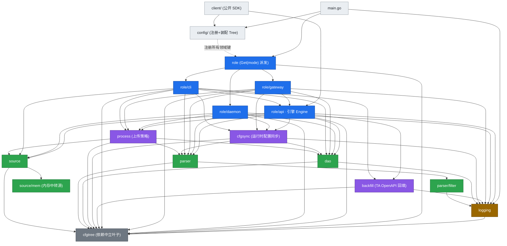
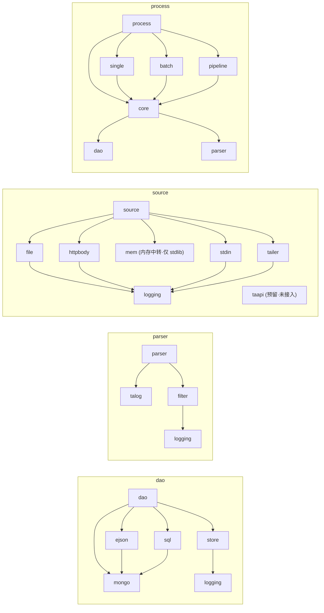

# tango v1.7 · `internal/` 逻辑依赖框架

> 本图描述 **v1.7 分支**（`internal/` 各包之间的 import 依赖）。依赖边是用
> `go list -f '{{.ImportPath}} {{.Imports}}'` 从编译器视角抽取的**真实直接 import**（非文档推断），
> 只保留模块内（`github.com/aura-studio/tango/...`）的边。架构总览见 [`arch.md`](arch.md) §2/§3/§7（§10 为 backfill 专章）。
>
> 一句话结构：**严格单向分层、无环**——角色层 → 编排领域 → 数据领域（根包）→ 子包 → 基础层 → `cfgtree` 叶子；
> 领域之间只经**根包**互引（root-fronts-subpackages），全仓**没有**任何跨域进子包的例外（`backfill` 现在只依赖
> `logging` + `cfgtree`，回填行经 `source/mem` 内存中转源喂进**普通上传管线**，不再下推任何 SQL filter）。

## 1. 分层依赖总览（internal/）

> 图中 `cfgtree` 收口了几乎所有 `*.Config` 模块的边（每个领域都依赖它的 `cfgtree.Tree` 载体）。
> `config`（在 `internal/` 外）按设计 import 了所有领域用于注册键，为保持框架可读，只画一条虚线示意。

## 2. 严格分层（自底向上，箭头一律指向更低层）

| 层 | 包 | 模块内直接依赖 |
|---|---|---|
| **L0 叶子** | `cfgtree` | （无——依赖中立配置载体，只依赖外部 `mapstructure`） |
| **L1 基础** | `logging` | `cfgtree` |
| **L2 子包** | `dao/mongo` | （无 internal） |
| | `parser/talog` | （无 internal） |
| | `source/mem` | （无 internal——只依赖 stdlib `context`/`errors`/`sync`）——内存中转源（relay），`source` 根包经 `NewMem` fronts 它 |
| | `source/taapi` | （无 internal）——**预留** stub，尚未接入 `source` 根包（`source` 不 import 它） |
| | `dao/store` | `logging` |
| | `parser/filter` | `logging` |
| | `source/file` · `source/httpbody` · `source/stdin` · `source/tailer` | `logging` |
| | `dao/ejson` · `dao/sql` | `dao/mongo` |
| | `process/core` | `dao` · `parser` · `logging` |
| | `process/single` · `process/batch` · `process/pipeline` | `process/core` · `dao` · `parser` · `source`（`single`/`pipeline` 另 `logging`） |
| **L3 领域根包** | `dao` | `dao/{store,mongo,ejson,sql}` · `cfgtree` · `logging` |
| | `parser` | `parser/{talog,filter}` · `cfgtree` |
| | `source` | `source/{file,httpbody,mem,stdin,tailer}` · `cfgtree` |
| | `process` | `process/{core,single,batch,pipeline}` · `dao` · `parser` · `source` · `cfgtree` |
| **L4 编排领域** | `cfgsync` | `dao` · `parser` · `logging` · `cfgtree` |
| | `backfill` | `logging` · `cfgtree`（仅此二者——纯 fetch+encode，回填行经 `source/mem` 喂进普通管线） |
| **L5 角色** | `role/api`（引擎） | `backfill` · `cfgsync` · `process` · `dao` · `parser` · `source` · `logging` · `cfgtree` |
| | `role/daemon` | `cfgsync` · `process` · `dao` · `parser` · `source` · `logging` · `cfgtree` |
| | `role/gateway` | `role/api` · `cfgsync` · `process` · `dao` · `parser` · `logging` · `cfgtree` |
| | `role/cli` | `role/api` · `backfill` · `cfgsync` · `process` · `dao` · `parser` · `source` · `cfgtree` |
| | `role` | `role/{cli,daemon,gateway}` · `cfgtree` |
| **（外）入口** | `config` | 所有领域（仅用其 `RegisterDefaults` 注册键） · `cfgtree` |
| | `main.go` | `config` · `role` · `logging` |
| | `client/` | `config` · `role/api` |

层与层之间**只向下**，同层之间无边——这就是「无环」的结构保证（见 §4）。

## 3. 领域内部组成（root-fronts-subpackages）

每个领域有唯一根包对外，子包是实现细节；跨领域只准引用**根包**（唯一例外见 §4）。
> 本节只画**领域内部组成**（根包 fronts 哪些子包、子包间关系），为可读做了简化：子包的**跨域出边**
> （如 `process/{single,batch,pipeline} → dao`/`parser`/`source`、`process/core → logging`、各 source 子包 → `logging`）
> 不在此重复，完整边以 §2 表为准。图中 `logging` 在各子图里就近重画，实际是同一个包。

## 4. 关键不变量与例外

1. **无环 / 严格单向**：所有模块内 import 边都从高层指向低层（角色 → 编排 → 领域 → 子包 → `logging` → `cfgtree`），
   不存在反向边或同层边。`GOTOOLCHAIN=go1.25.5 go build ./...` 与 `go list -deps ./...` 均通过（Go 编译期本就拒绝 import cycle），即结构无环。
2. **root-fronts-subpackages**：领域之间只经根包互引（`dao`/`parser`/`source`/`process` 各自重导出门面），
   不存在 `process/* → dao/store`、`role/* → source/tailer` 这类跨域子包引用。
3. **无跨域进子包的例外**：除根包互引外，全仓**没有**任何「跨域直引子包」的边——旧 v1.6.1 那条
   `backfill → parser/filter`（`filter.CompileToSQL` 把 expr 选择 filter 下推成 TA SQL）已随 backfill 重写一并删除。
   `backfill` 现在只 import `logging` + `cfgtree`（一个近叶子的纯 fetch+encode 域），不碰 `parser`/`dao`/`process`/`source`
   任何子包；选择性（事件名以外）回到引擎的上报 filter（`parser.filter.*`）。可用
   `GOTOOLCHAIN=go1.25.5 go list -f '{{join .Imports "\n"}}' ./internal/backfill/ | grep aura-studio` 复核（只剩 `logging`、`cfgtree`）。
4. **`role/api` ↔ `backfill` 不成环**：`role/api → backfill`（`Engine.RunBackfill` 起一个 `Fetcher`），
   但 `backfill` **不** import `role/api`、也不 import `process`/`source`。回填行经一个 `func(line string) error`
   注入回调推入 `source/mem` 内存中转源，`Engine.RunBackfill` 强制以 **pipeline** 模式起一个 uploader 并发 drain 它
   （producer 失败时 derived ctx 取消以解开阻塞的 `Push`），从而完全复用普通上传管线、又不引入 `api ↔ backfill` 的潜在环。
5. **`client` / `config` 的边界**：公开 SDK `client` 在 `internal/*` 里**只** import `role/api`（另加顶层公开包
   `config`，见 §2 表）——经 `api.BackfillConfig` 等别名拿配置，不直接 import `internal/backfill`、`internal/source`、
   `internal/dao`，由 importboundary 测试守门；
   `config` 是唯一允许「横向 import 所有领域」的包，但只为注册配置键，不参与运行时数据流。
6. **`cfgtree` 是叶子**：依赖中立，不 import 任何 internal 包；`logging` 仅依赖 `cfgtree`。
   二者是被最广泛复用的底座（图 §1 中几乎每个节点都最终汇到它们）。

## 5. v1.7 相对 v1.6（file）新增的依赖

v1.7 = 当前 v1.6（`file` 源 + v1.5.11 daemon 修复）逻辑性叠加**重新设计后的 backfill 域**：backfill 只负责
fetch + encode，回填行经一个全新的 `source/mem` 内存中转源喂进引擎**普通上传管线**，与实时上报走完全相同的
parse → filter → identity → write 路径。新增/变化的依赖边只有：

- **新增 `internal/source/mem`**（channel 背书的 `source.Source`，`New(buf)`/`Push`/`Close`/`Run`，单 producer）——
  只依赖 stdlib（`context`/`errors`/`sync`），**无任何 internal import**；`source` 根包经 `NewMem` fronts 它，
  故 `internal/source →` 增一条 `source/mem` 边。
- `internal/backfill →` `logging` · `cfgtree`（**仅此二者**——一个近叶子的纯 fetch+encode 域）。
  相比旧设计**删除**了对 `dao`、`process`、`parser/filter` 的依赖（连带那条「唯一跨域进子包」例外一并消失）。
- `internal/role/api →` `backfill` 与 `source`（`Engine.RunBackfill` 起 `Fetcher` + `source.NewMem` 中转 +
  强制 pipeline uploader）；`internal/role/cli →` `backfill`（角色层接入回填面）。
- `config →` `backfill`（注册新的 `backfill.*` 键集）。

**`parser` 与 `dao` 相对 v1.6 零修改**：旧设计加的 `parser/filter.CompileToSQL`（SQL 下推）与
`dao` 的 `UserSnapshotWriteModel` 均已删除——user 表行现在也走管线、由 `#account_id`/`#distinct_id` 解析出
tango 的 `#user_id` 后复用既有 `UserWriteModel`（`user_setOnce`/`user_set`），无需独立写模型。
回填**无 checkpoint / 无 `_backfill_progress` / 无 RunID / 无 SQLSignature 漂移守卫**：重跑即重抓，
幂等交给写模型（events `#uuid $setOnInsert`、users `#user_id user_setOnce`）。

**未**引入 worker / taskqueue 域（那是旧 v1.6.2 线，不在 v1.7）。
